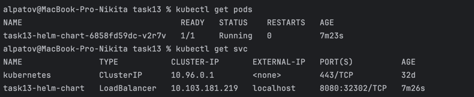
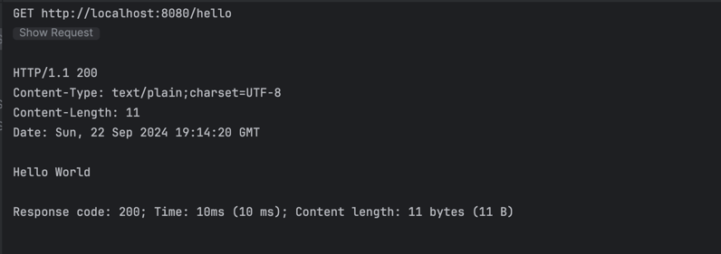

# Запуск SpringBoot приложения в Kubernetes с помощью Helm

## Описание

Создать SpringBoot приложение с эндпоинтами и запустить его в Kubernetes с помощью Helm

Для создания jar файла  
```mvn package```

Поднимаем локальный regestry  
``` docker run -d -p 5001:5000 --restart=always --name registry registry:2```

Для сборки образа:  
```docker build -t task13_image .```  
```docker tag task13_image:latest localhost:5001/task13_image:latest```  
```docker push localhost:5001/task13_image:latest```

Для запуска образа:    
```docker run -d -p 80:8080 task11-12_image ```

Создаём chart  
```helm create helm-chart```

Запускаем  
```helm install helm-chart ./helm-chart ```

Рузльтаты:  




