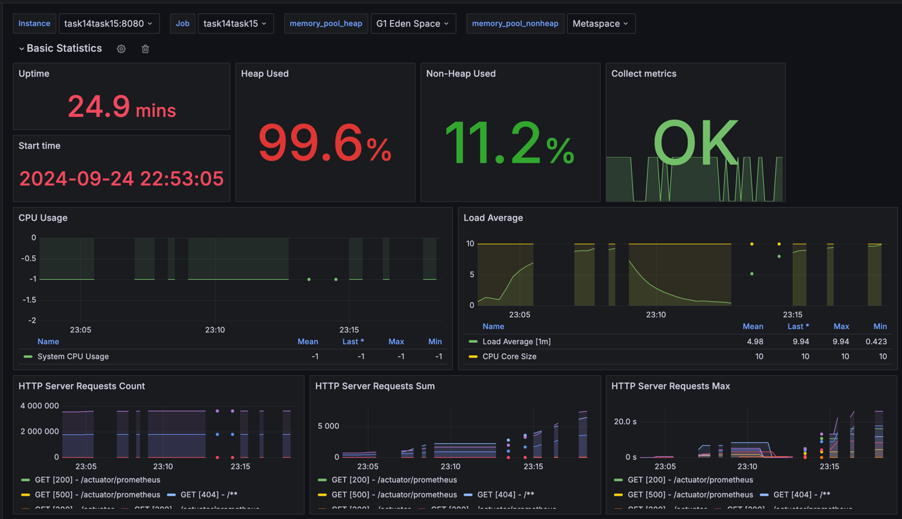
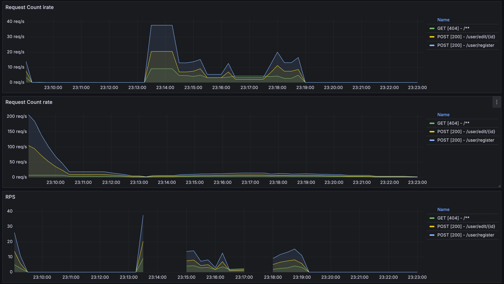
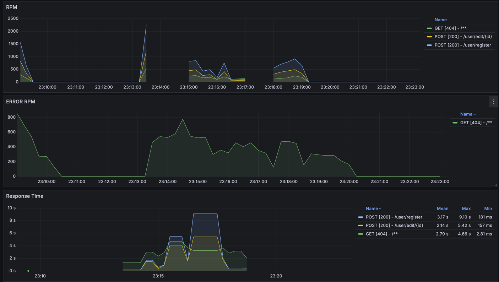
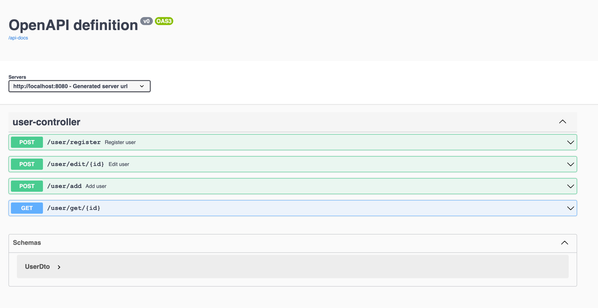

# Реактивное программирование: Reactor + Вспоминаем Docker

## Описание

Реализация сервиса с использованием реактивного подхода и Запуск SpringBoot приложения в Docker

Для создания jar файла  
```mvn package```

Для сборки образа:  
```docker build -t task14-15_image .```

Для запуска:   
```docker-compose up```

План для нагрузки:  
 [Test Plan.jmx](Test%20Plan.jmx)

Метрики в Grafana  


  
Подключенный SwaggerAPI 
