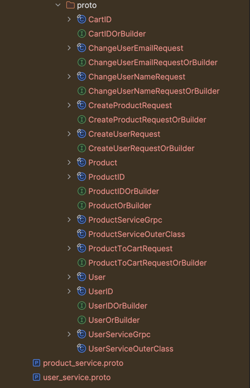
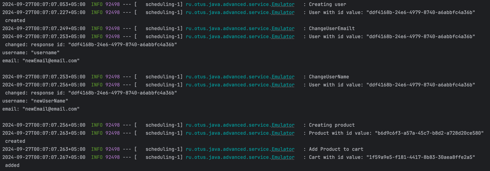

# Описать gRPC сервис

## Описание
Описать gRPC сервис и приложить скриншоты вывода консоли в пул реквест (вместе с рабочим кодом)

Для генерации сущностей  
```mvn compile```



Лог взаимодействия client -> server  

