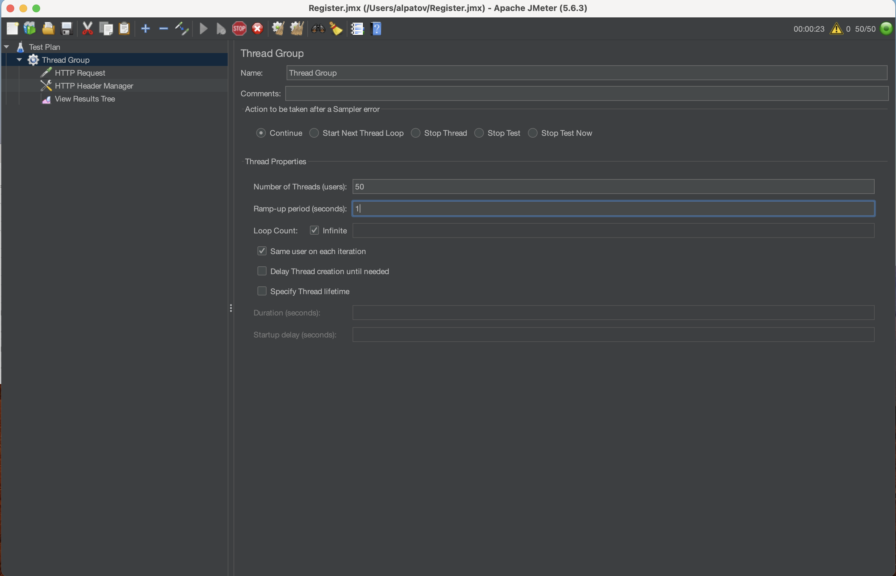

# Поиск утечки памяти в приложении

## Описание
Реализован сервис регистрации пользователей. 
Параметры запуска  
Через jmeter отправляются запросы.
#### -Xmx64m -XX:+HeapDumpOnOutOfMemoryError -XX:+UseParallelGC

Анализируя dominator_tree можно сказать, что кэш содержит большое количество записей и занимает 17% памяти.

Чтобы избавиться от этой проблемы, заменяю реализацию кэша с HashMap на кэш от Caffeine.

Проблема с ООМ из-за кэша решена

