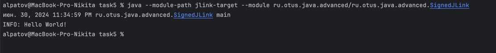
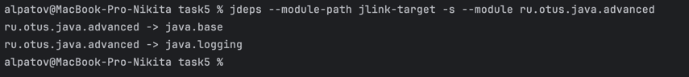
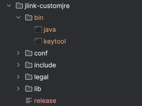
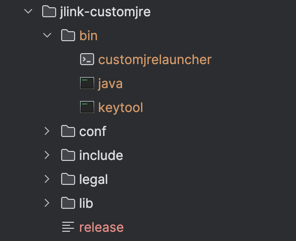
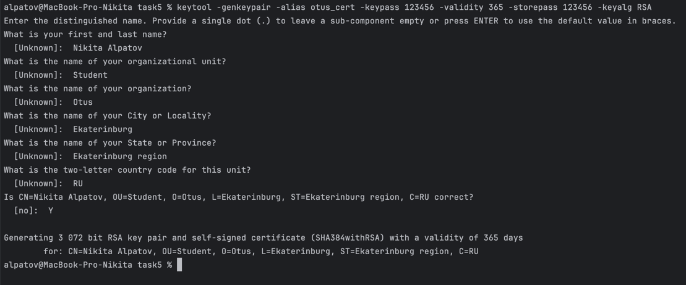
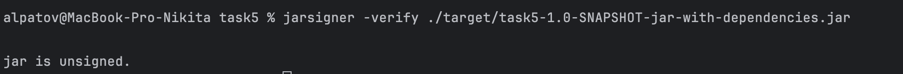
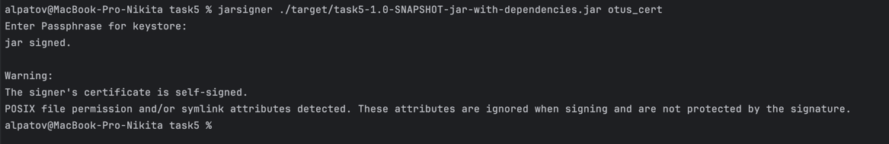
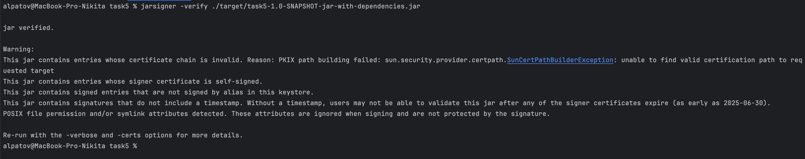

# JDK tools


## Описание
```mvn package```
для создания jar файла

```bash
javac -d jlink-target ./src/main/java/module-info.java
```


```bash
javac -d jlink-target --module-path jlink-target ./src/main/java/ru/otus/java/advanced/SignedJLink.java
```


```bash
java --module-path jlink-target --module ru.otus.java.advanced/ru.otus.java.advanced.SignedJLink
```



```bash
jdeps --module-path jlink-target -s --module ru.otus.java.advanced
```


```bash
 jlink --module-path "/Users/alpatov/IdeaProjects/Java-Advanced-homework/alpatov/task5/jlink-target" --add-modules ru.otus.java.advanced  --output jlink-customjre
 ```



```bash
jlink --launcher customjrelauncher=ru.otus.java.advanced/ru.otus.java.advanced.SignedJLink --module-path "/Users/alpatov/IdeaProjects/Java-Advanced-homework/alpatov/task5/jlink-target" --add-modules ru.otus.java.advanced --output jlink-customjre
 ```


```bash
"/Users/alpatov/IdeaProjects/Java-Advanced-homework/alpatov/task5/jlink-customjre/bin/java" -classpath "/Users/alpatov/IdeaProjects/Java-Advanced-homework/alpatov/task5/jlink-customjre" --module ru.otus.java.advanced/ru.otus.java.advanced.SignedJLink
 ```


```bash
keytool -genkeypair -alias otus_cert -keypass 123456 -validity 365 -storepass 123456 -keyalg RSA
 ```


```bash
jarsigner -verify ./target/task5-1.0-SNAPSHOT-jar-with-dependencies.jar
 ```



```bash
jarsigner ./target/task5-1.0-SNAPSHOT-jar-with-dependencies.jar otus_cert
 ```


```bash
jarsigner -verify ./target/task5-1.0-SNAPSHOT-jar-with-dependencies.jar
 ```

