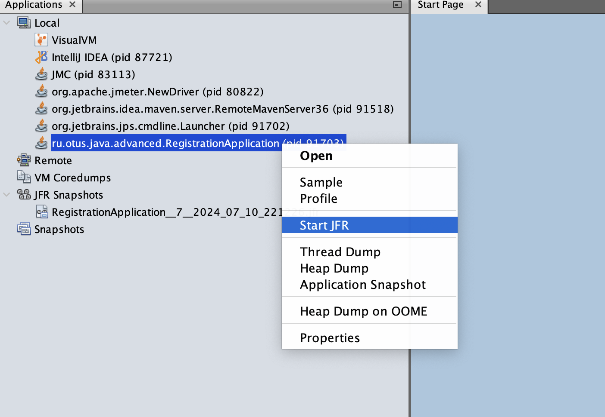
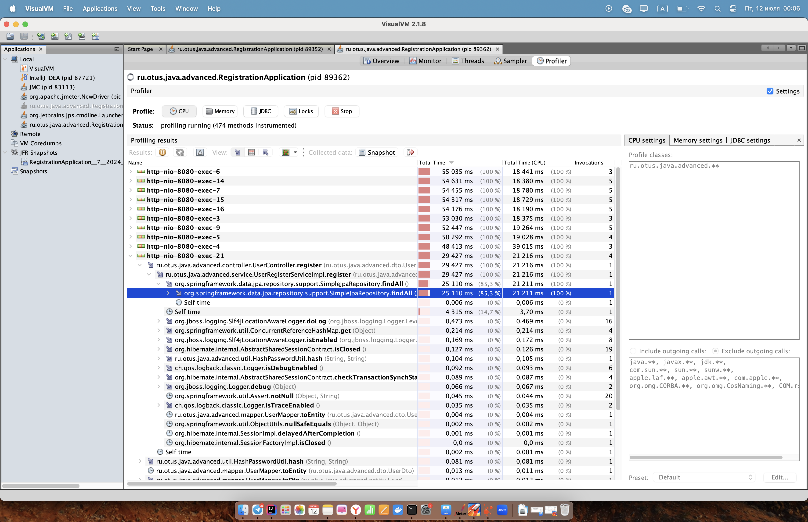
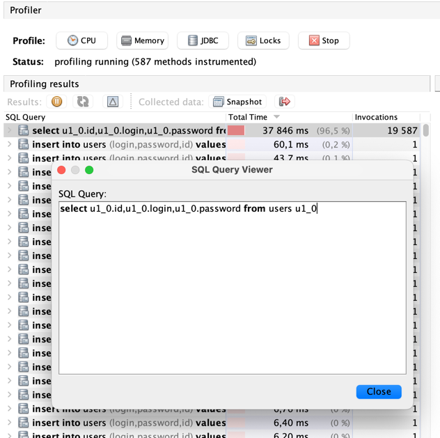

# Диагностика приложения с помощью JFR

## Описание
Запускаем JFR через VisualVM 

Запускаем нагрузку через Jmeter

Во вкладке Profiler видим, что метод findAll() выполняется большую часть времени 

Смотрим запрос, который выполняется дольше всего 

