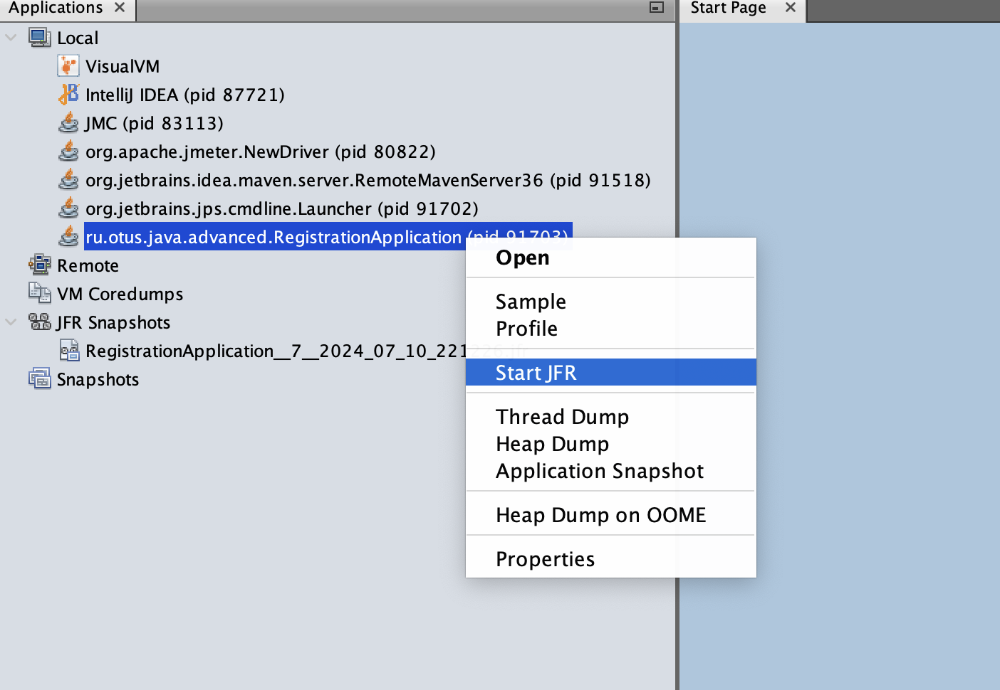
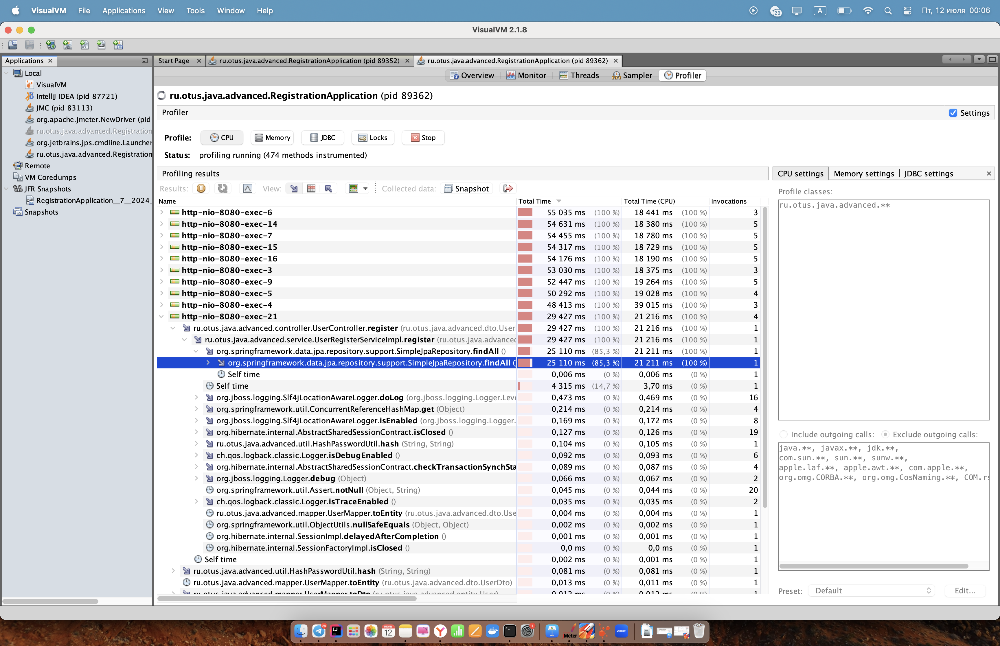
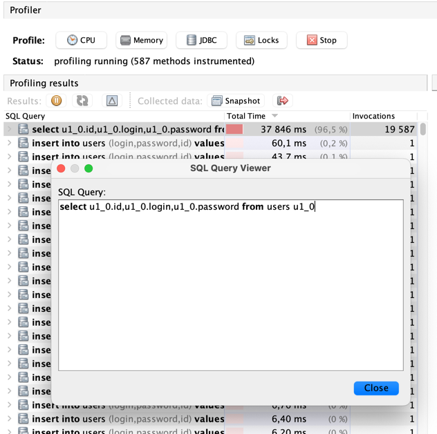
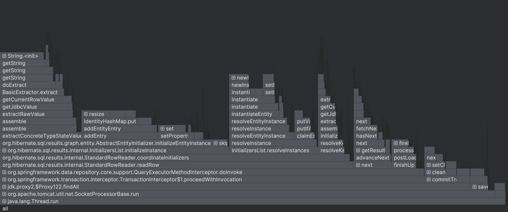
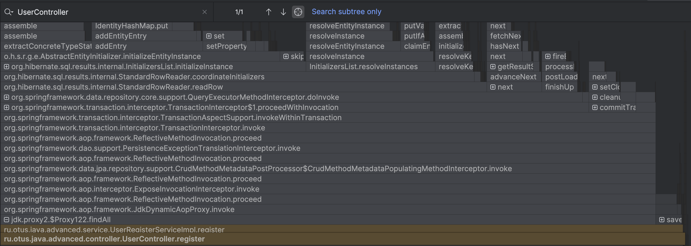

# Профилирование с помощью visualvm

## Описание

В работе имитируется проблема - лишний запрос в БД findAll().

Запускаем JFR через VisualVM 

Запускаем нагрузку через Jmeter

Во вкладке Profiler видим, что метод findAll() выполняется большую часть времени 

Смотрим запрос, который выполняется дольше всего 

Запускаем AsyncProfiler.  
Также запускаем нагрузку через Jmeter.  

Фильтруем граф по контроллеру, куда приходит запрос и видим, что большую часть занимает ненужный метод findAll()

