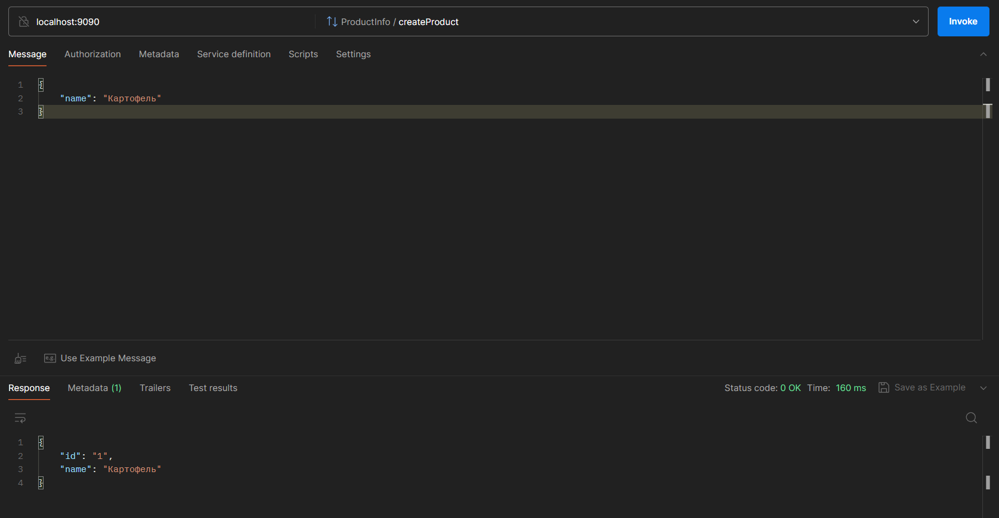

Требования: Java 17

## Задание:
Подключить gRPC в проект
1. Описать сущности при помощи protobuf:
#### User (email, username, id)
#### Product (name, id)
2. Описать сервис при помощи protobuf:
#### createUser(email, username) returns id
#### changeUserEmail(id, email)
#### changeUserName(id, username)
#### createProduct(name) returns id
#### addProductToCart(usderId, productId)
Реализовать сервис в Java

## Как воспроизвести работу приложения:
1. Run server Application Launcher
2. Test

