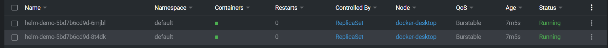
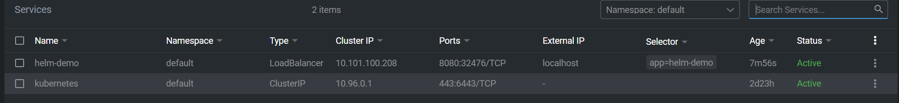
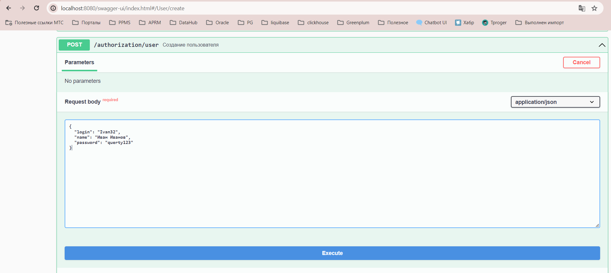

Требования: Java 17


## Задание:
1. Запуск SpringBoot приложения в Kubernetes с помощью Helm
## Как воспроизвести работу приложения:
1. Поднимать приложение будет на локальном Kubernetes кластере который предоставляется
в Docker Desktop.
2. Поднимаем локальный registry
```
docker run -d -p 5000:5000 --restart=always --name registry registry:2
```
  В конфиге Docker Engine добавляем и рестартуем
```"insecure-registries": ["localhost:5000"]```
3. Создаем и пушим образ нашего приложения на локальный registry
```
docker build -t helm-demo:0.1 .
docker tag helm-demo:0.1 localhost:5000/helm-demo:0.1
docker push localhost:5000/helm-demo:0.1
```
4. Устанавливаем helm, создаем структуру для чарта
```helm create helm-demo```
5. Заполняем структуру - создаем чарт, шаблоны ресурсов и значения для чарта
6. ```helm install helm-demo ./helm-demo```
7. Проверяем, что поднялось 2 пода и сервис с типом LoadBalancer!


8. Проверяем доступность из локального браузера

9. Смотрим логи - helm-demo-5bd7b6cd9d-6mjbl.log.
Видим, что наш запрос успешно обработано подом.