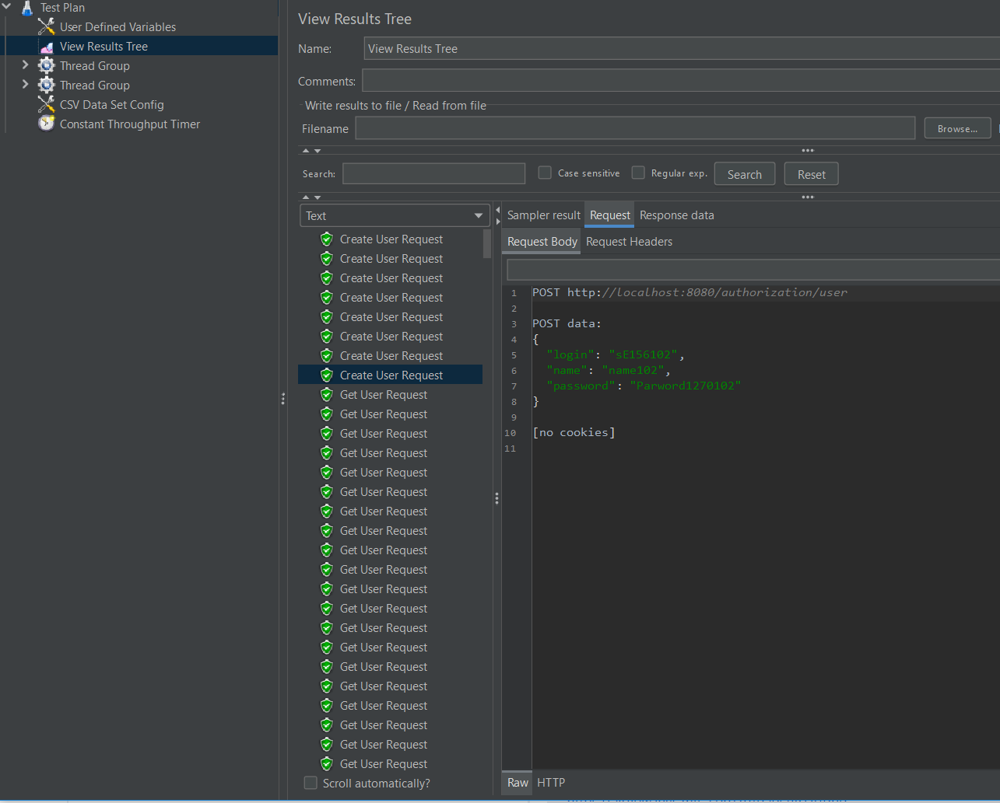

Требования: Java 17

## Задание:
Создать тестовый план с регулиремым RPS.
1. Сделать тесты через UI-ный интерфейс Jmetera
2. Сделать тесты через отдельный подмодуль с библиотекой Jmeter.
При старте данного подмодуля jar должен запускаться и генерировать нагрузку на основное приложение

## Как воспроизвести работу приложения:
1. Запустить модуль service
2. Запустить приложенный тест через UI - test_with_2_requests_and_rps.jmx
3. Запустить модуль integrated-jmeter - в результате будет запущен нагрузочный тест и лог будет
выгружен в файл output-logs.jtl (содержится в коммите)
