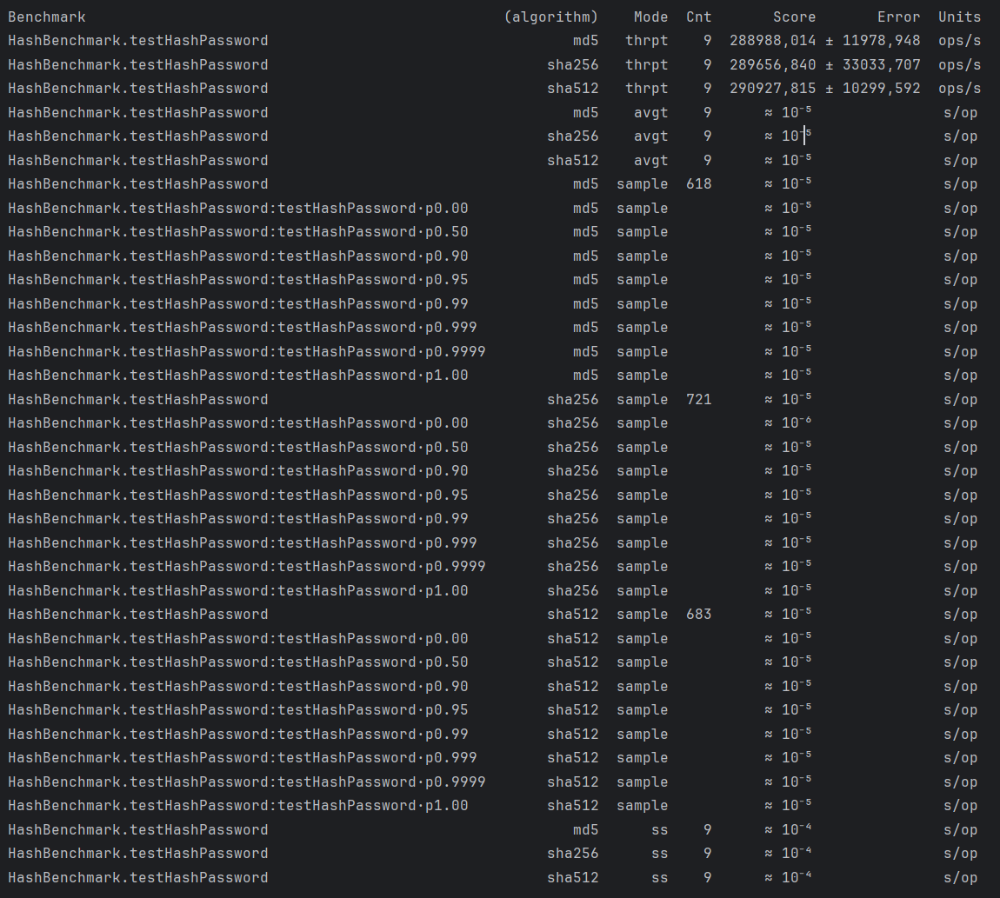

Требования: Java 17


## Задание:
1. Использовать приложение из предыдущих заданий. Для выполнения задания потребуется сервис регистрации пользователя, реализованный ранее.
2. Добавить в сервис регистрации логику по хешированию пароля с последующим сохранением хеша в БД
3. Реализовать несколько тестов по производительности:
- тест на логику хеширования пароля с применением 3 разных алгоритмов: Md5, sha256, sha512 (возможно, в качестве параметра использовать число итераций) - чтобы была сравнительная статистика. Чтобы обоснованно выбрать для сервиса менее тяжелый вариант
* тест на общий сервис регистрации клиента (без учёта инициализации spring, траспорта http rest)
Замерить все доступные в JMH метрики: Throughput, AverageTime, SampleTime, SingleShotTime
4. Выбрать 3 различных теста от https://hg.openjdk.org/code-tools/jmh/file/tip/jmh-samples/src/main/java/org/openjdk/jmh/samples/ и предоставить отчёт о запуске этих тестов.

## Как воспроизвести работу приложения:
1. Результат тестирования benchmark для работы хеш функции

Можно сделать вывод, что скорость почти не отличается у разных алгоритмов хеширования
2. JMHSample_21_ConsumeCPU
```shell
Benchmark                             Mode  Cnt     Score     Error  Units
JMHSample_21_ConsumeCPU.consume_0000  avgt    5     6,298 ±   7,692  ns/op
JMHSample_21_ConsumeCPU.consume_0001  avgt    5     3,996 ±   0,164  ns/op
JMHSample_21_ConsumeCPU.consume_0002  avgt    5     4,479 ±   0,365  ns/op
JMHSample_21_ConsumeCPU.consume_0004  avgt    5     6,617 ±   0,800  ns/op
JMHSample_21_ConsumeCPU.consume_0008  avgt    5    11,694 ±   1,443  ns/op
JMHSample_21_ConsumeCPU.consume_0016  avgt    5    21,500 ±   3,773  ns/op
JMHSample_21_ConsumeCPU.consume_0032  avgt    5    50,820 ±   3,273  ns/op
JMHSample_21_ConsumeCPU.consume_0064  avgt    5   118,072 ±  18,953  ns/op
JMHSample_21_ConsumeCPU.consume_0128  avgt    5   291,324 ±  70,201  ns/op
JMHSample_21_ConsumeCPU.consume_0256  avgt    5   531,845 ± 114,904  ns/op
JMHSample_21_ConsumeCPU.consume_0512  avgt    5  1058,760 ± 348,331  ns/op
JMHSample_21_ConsumeCPU.consume_1024  avgt    5  1984,207 ± 400,787  ns/op
```
JMHSample_26_BatchSize
```shell
Benchmark                              Mode  Cnt   Score    Error  Units
JMHSample_26_BatchSize.measureWrong_1  avgt    5  ≈ 10⁻⁵            s/op
JMHSample_26_BatchSize.measureWrong_5  avgt    5  ≈ 10⁻⁴            s/op
JMHSample_26_BatchSize.measureRight      ss    5   0,009 ±  0,002   s/op
```
JMHSample_37_CacheAccess
```shell
Benchmark                          Mode  Cnt   Score   Error  Units
JMHSample_37_CacheAccess.colFirst  avgt   25  14,291 ± 1,169  ns/op
JMHSample_37_CacheAccess.rowFirst  avgt   25   1,434 ± 0,071  ns/op
```