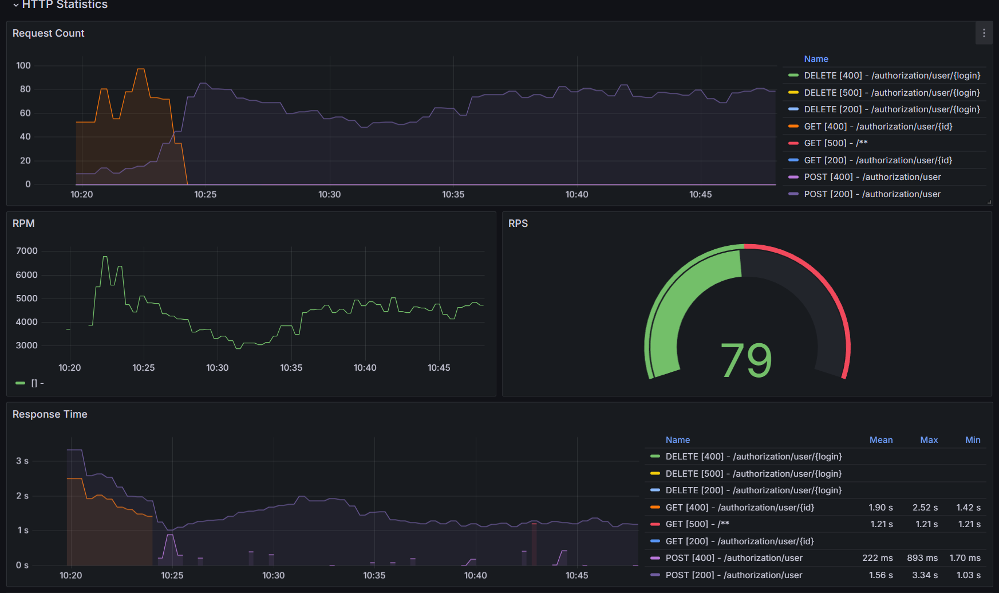

Требования: Java 17
На прошлом уроке был поднят локальный k8s кластер в docker-decktop
поднят локальный docker regitsry на 5000 порту http://localhost:5000/

## Задание:
1. Создать метрики для отслеживания нагрузки на Rest сервис
   Покрыть Rest сервис метриками, построить дашборд к Grafana и продемонстрировать результаты дашборда, подавая нагрузку через JMeter

## Как воспроизвести работу приложения:
1. Поднимаем приложение в кластере
   docker build -t helm-demo:0.2 .
   docker tag helm-demo:0.2 localhost:5000/helm-demo:0.2
   docker push localhost:5000/helm-demo:0.2
   helm install helm-demo ./helm-demo
   Убеждаемся что под поднялся и по эндпоинту http://localhost:8080/actuator/prometheus есть метрики
2. Поднимаем графану и прометеус ./infra_install.sh
3. Загружаем стандартный дашборд Spring Boot Statistics в grafana
4. Подаем нагрузку на приложение через Apache Jmeter
5. Наблюдаем за изменением метрик
  
  
  
  

Почему то в моменте подачи нагрузки на под есть "пробел" в метриках, 
что сложно объяснить с учетом того что рестартов пода не было.