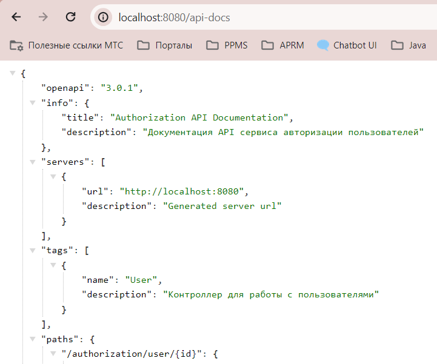
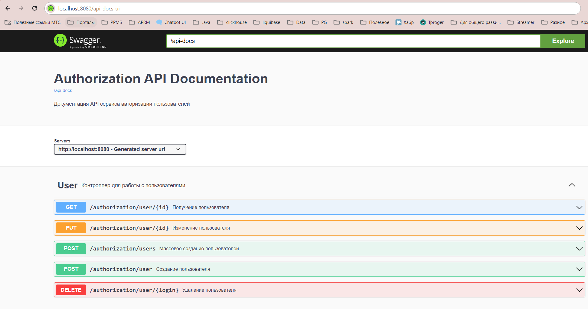
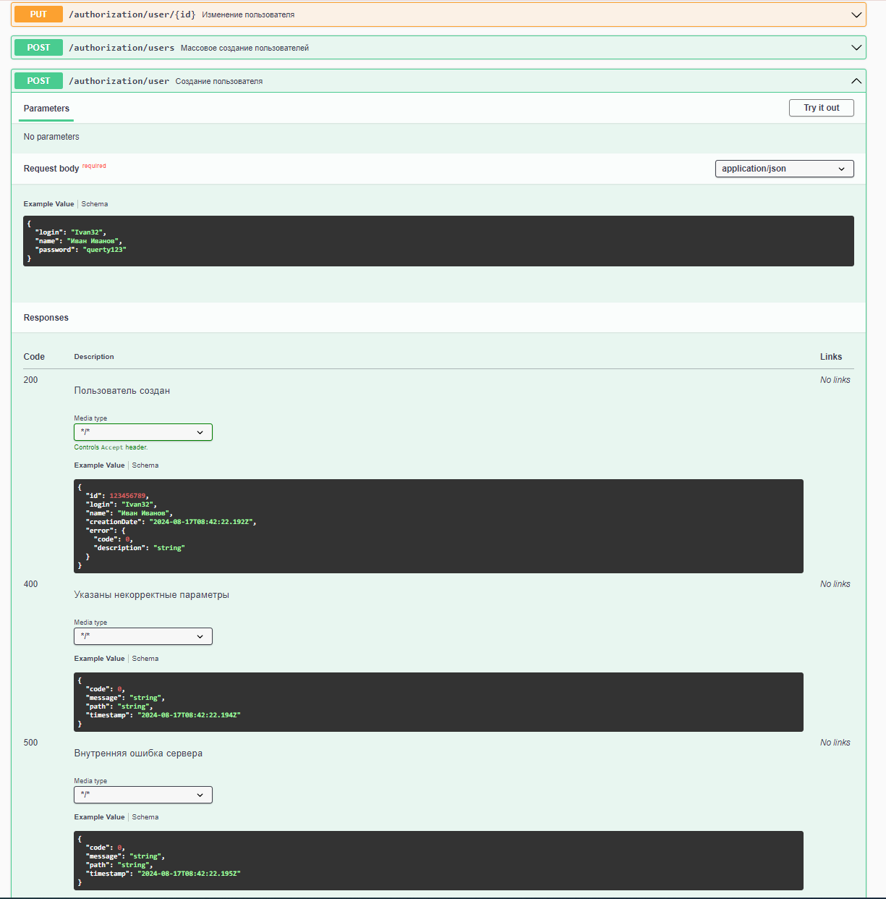

Требования: Java 17
На прошлом уроке был поднят локальный k8s кластер в docker-decktop
поднят локальный docker regitsry на 5000 порту http://localhost:5000/


## Задание:
1. Подключить OpenAPI в проект
2. Описать пустое (stub) API со следующими эндпойнтами:
3. POST /user/add (принимает произвольный JSON)
4. POST /user/edit?id= (принимает произвольный JSON)
5. GET /user/get?id= (возвращает произваольный JSON)
6. Настроить эндпойнт для OpenAPI по адресу /api-docs
7. Подключить SwaggerAPI и замапать его на /api-docs-ui

## Как воспроизвести работу приложения:
1. Для работы будут использованы endpoints из прошлых уроков
2. Поднимаем приложение
```
docker build -t helm-demo:0.3 .
docker tag helm-demo:0.3 localhost:5000/helm-demo:0.3
docker push localhost:5000/helm-demo:0.3
helm install helm-demo ./helm-demo
```
3. Проверяем эндпоинты OpenAPI и SwaggerAPI


