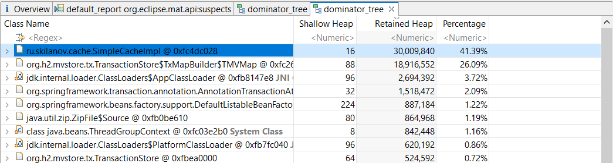
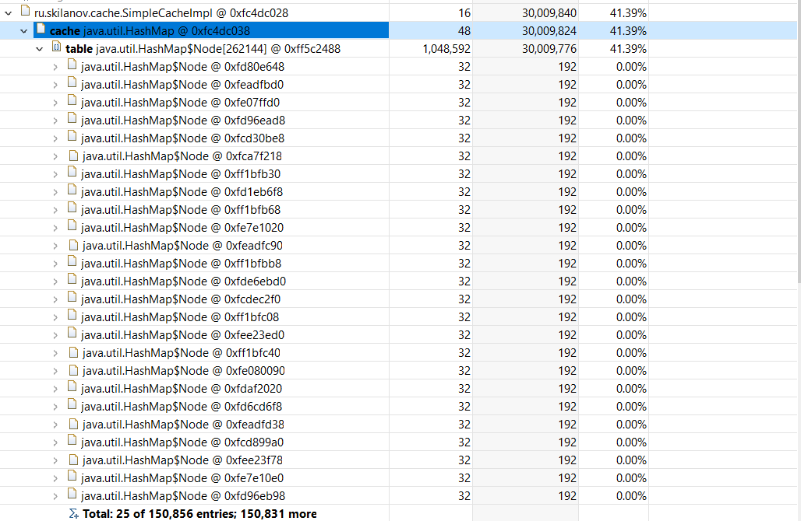

# Memory dump hw

### Стэк:
Spring Boot, Spring Data JPA, Liquibase, H2, Spring Boot Test

### Параметры запуска приложения для получения OotOfMemoryError
Создал postman коллекцию и запустил параллельно 3 запроса в рест сервис из 3 коллекций.
Параметры запуска: 
-Xms30m -Xmx30m -XX:+UseParallelGC -XX:+HeapDumpOnOutOfMemoryError

### Анализ MAT Dump
В ходе анализа dump было найдено 3 проблемы:

Построил dominator tree, отсортировал и нашел класс из приложения

Содержащаяся в нём Map содержит почти 2000 записей:

