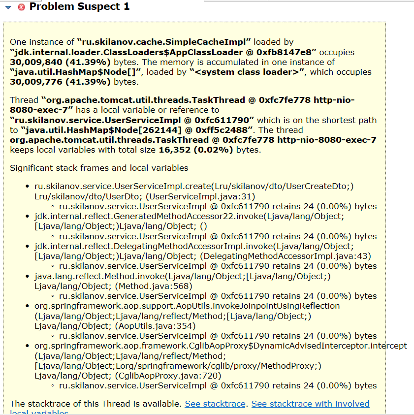

# Memory dump hw

### Стэк:
Spring Boot, Spring Data JPA, Liquibase, H2, Spring Boot Test

### Тестирование
Для тестирования приложения использовал JMeter.

### Параметры запуска приложения для получения OutOfMemoryError
-Xms80m -Xmx80m -XX:+UseParallelGC -XX:+HeapDumpOnOutOfMemoryError

### Анализ Eclipse MAT Dump
В ходе анализа dump было найдено 2 проблемы и первая из них указывала на утечку:

Построил dominator tree, отсортировал и нашел класс SimpleCacheImpl из приложения

Содержащаяся в нём Map содержит большое количество записей и занимает 41.39%:

