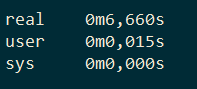

# Memory dump hw

### Стэк:
Spring Boot, Spring Data JPA, Liquibase, H2, Spring Boot Test

### Class data sharing
Создал скрипты:
- для создания списка классов: create_class_list.sh
- для создания архива: start_dump.sh
- запуска приложения с cds архивом: start_with_app_cds.sh
Время запуска приложения с cds архивом:

- обычный запуск приложения: start_without_cds.sh
Время запуска приложения без cds архива:

Также был создан скрипт make_cds.sh, который обходит ошибку "[error][cds] Error: non-empty directory" и формирует большой
cds архив, однако время старта приложения с таким архивом превышает время запуска приложения без него.

