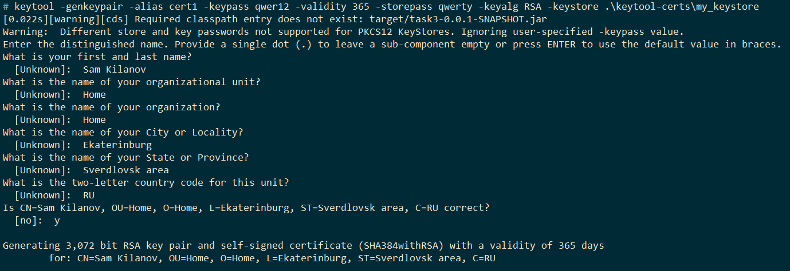
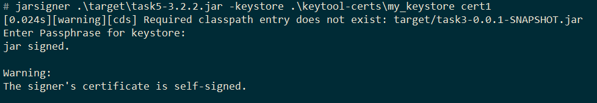
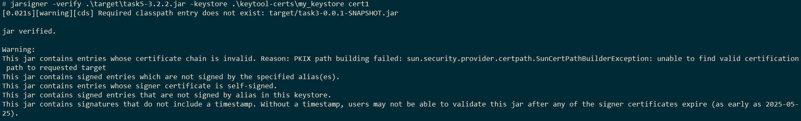

# Создаие, верификация сертификата с помощью keytool и создание легковесной JRE с помощью jlink.
## keytool
Генерация сертификата с помощью комманды:
#### keytool -genkeypair -alias cert1 -keypass qwer12 -validity 365 -storepass qwerty -keyalg RSA -keystore .\keytool-certs\my_keystore

Подпись jar файла сертификатом с помощью комманды:
#### jarsigner .\target\task5-3.2.2.jar -keystore .\keytool-certs\my_keystore cert1

Верификация jar файлас помощью команды:
#### jarsigner -verify .\target\task5-3.2.2.jar -keystore .\keytool-certs\my_keystore cert1

## jlink:
Компиляция приложения с помощью комманд:
#### javac -d jlink-target .\src\main\java\module-info.java
#### javac -d jlink-target --module-path jlink-target ./src/main/java/ru/skilanov/Application.java
Создание JRE с помощью комманды:
#### jlink --launcher customjrelauncher=skilanov/ru.skilanov.Application --module-path "C:\projects\Java-Advanced-homework\kilanov\task5\jlink-target;C:\Program Files\BellSoft\LibericaJDK-21\jmods" --add-modules skilanov --output jlink-customjre
Запуск приложения с помощью комманды:
#### .\jlink-customjre\bin\customjrelauncher.bat