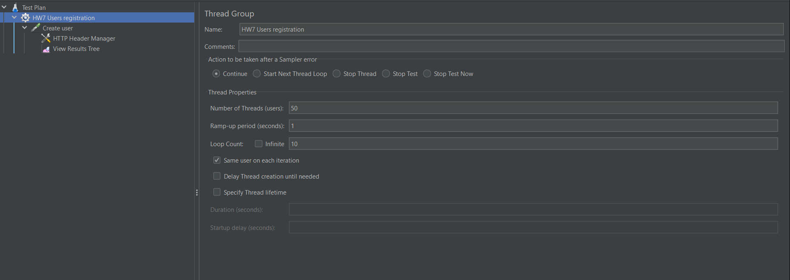
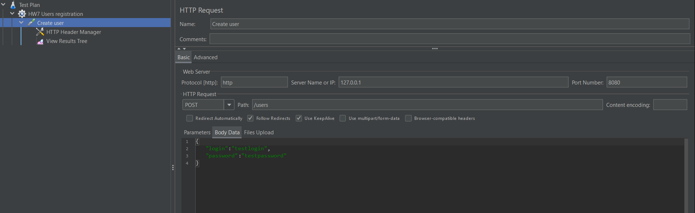
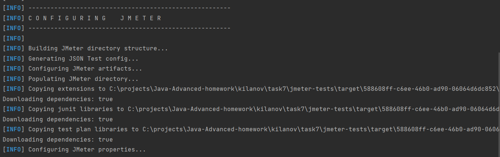
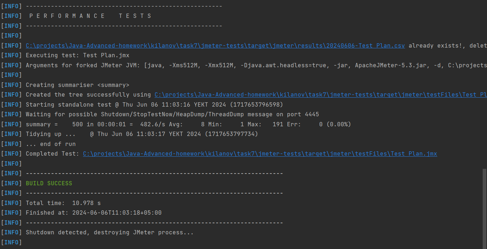

# Jmeter

### Стэк:
Spring Boot, Spring Data JPA, Liquibase, H2, Spring Boot Test

### Описание
Два приложения: main-app(тестируемое) и jmeter-tests(тестирующее).
Для запуска тестов необходимо выполнить mvn verify

### Создание плана теста

В jmeter был создан http план тестирования rest метода регистрации пользователей:

### Результаты тестирования

После запуска основного приложения и вполнения mvn verify теструющего был получен следующий вывод:

