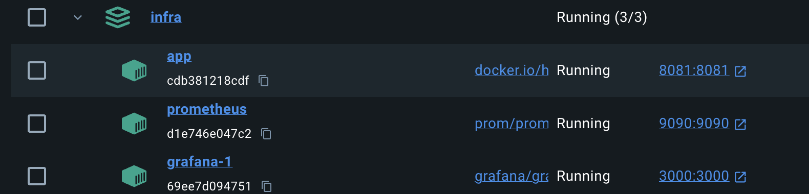
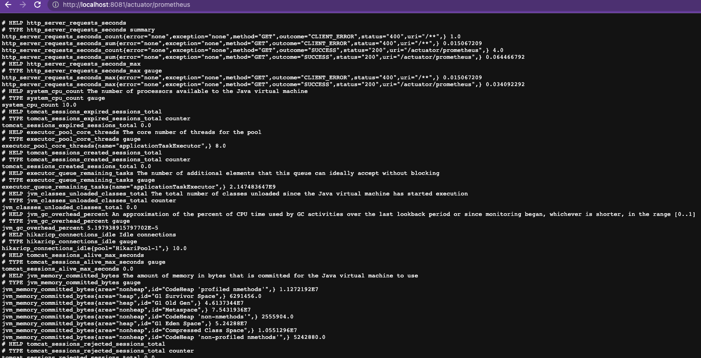
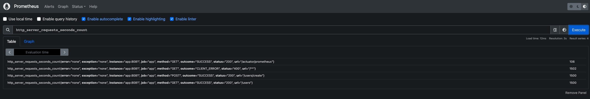
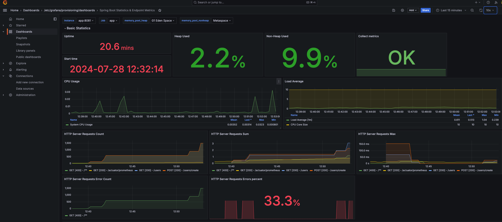
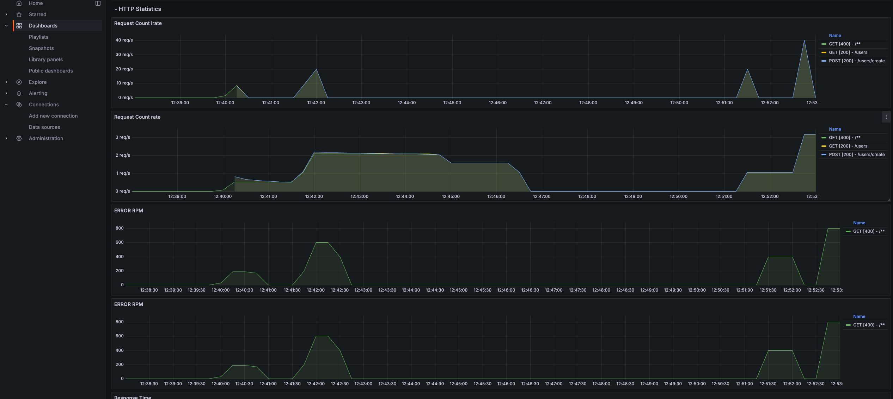
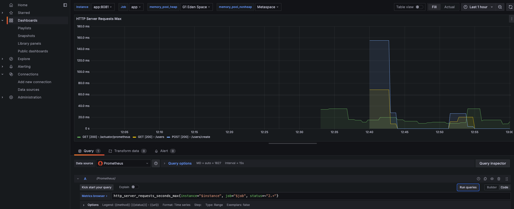
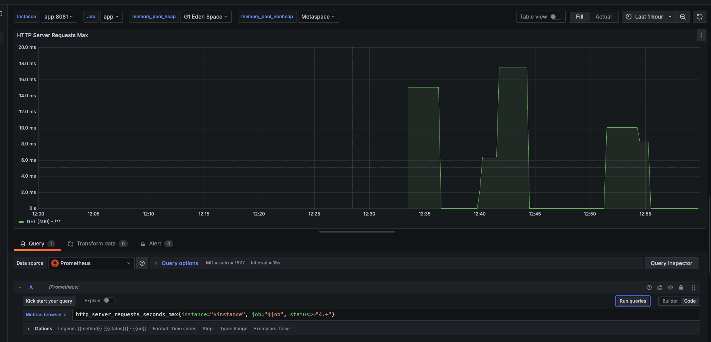

# Homework Prometeus/Gragana.

## Run app, prometeus and grafana services via docker-compose.
```
docker-compose -f docker-compose.yml up -d 
```



## Check that actuator work, open:
```
http://localhost:8081/actuator/prometheus
```


### Login to Grafana(admin/qwerty)
```
http://localhost:3000/ 
```

### Run jMeter load profile: HTTP Request Defaults.jmx


### Check that prometheus collect logs, go to:
```
http://localhost:9090/
```



### Check requests statistic in grafana:



### Filter success requests:



### Filter bad requests:
