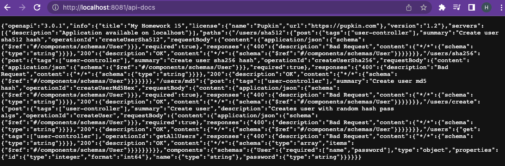
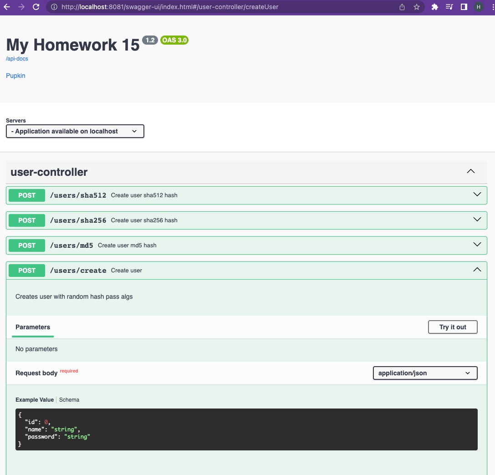
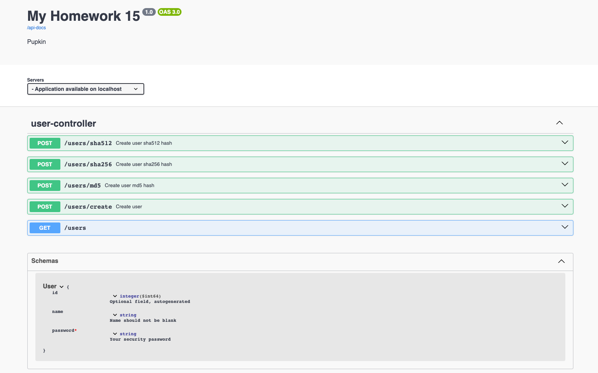

# Homework Swagger:.

## Run app:
```com.example.otus.Homework15Application```

### Open OpenApi generated doc:
```http://localhost:8081/api-docs```



### Open SwagerUi:
```http://localhost:8081/api-docs-ui```



### User description:
