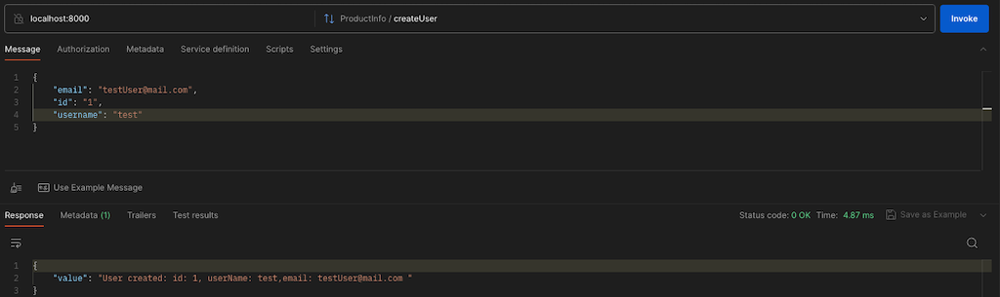
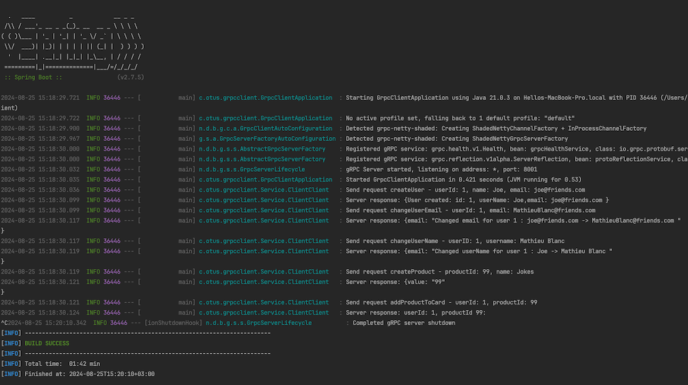
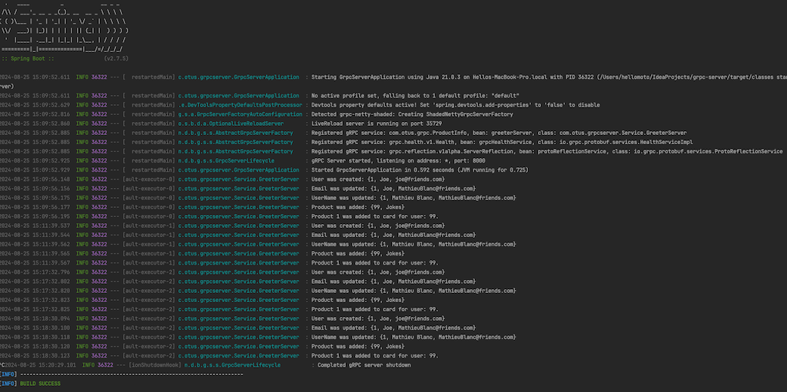

# Homework 16 grpc

How to run:
Build grpc-proto module to generate server and client stubs to m2 dir from our *.proto file.


```bash
mvn clean install 
```

Then add dependency to maven: client and server apps.

```
		<dependency>
			<groupId>com.otus.grpc</groupId>
			<artifactId>grpcproto</artifactId>
			<version>0.0.1-SNAPSHOT</version>
		</dependency>
```


Run  client and server:

```
mvn clean package # For installing required libraries
mvn spring-boot:run # For starting the project (server side) 
```

Send request and got a response:


LOG CLIENT:


LOG SERVER:


