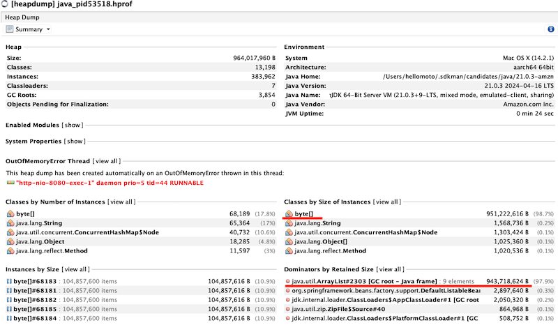
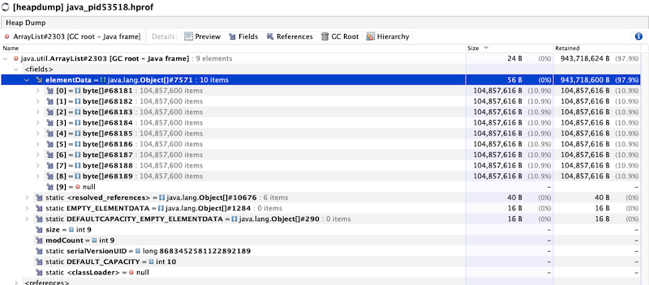

### Homework by the lesson "Memory Dump".

## How to run:(Change heap dump path)

```java -Xms10m -Xmx1g -XX:+HeapDumpOnOutOfMemoryError -XX:HeapDumpPath=path/to/heapdump Homework2Application.java```

## Swagger API:

```http://localhost:8081/swagger-ui/index.html#/```

## Instruction:

1) Run app (Homework2Application.java main class)

2) Register several users by POST request:

Body should contain random string name and numerical password:
``` 
curl --location 'http://localhost:8080/users' \
--header 'Content-Type: application/json' \
--data '{
    "name": "Test1",
    "password":"12345"
}'
```

How works mechanism of memory leaking:
1) Depends on password length (Cache.class):
Put password in cache by the way: cache.put(key, new Integer[value * 999]);

If password.length will be more than  then we got OutOfMem immediately after POST request;

2) Every time when we use POST request service added memoryLeakList.add(new byte[1024 * 1024 * 100]);

Options: to activate background process of memory leak: uncomment BeanMemoryEater.java (every seconds it increase MemoryLeakList on 100mb) 


After each request you can check memory state in console log:
```
Before added to cache: Total Memory  : 57 MB
Before added to cache: Max Memory    : 1024 MB
Before added to cache: Free Memory   : 14 MB
Before added to cache: Used Memory   : 43 MB
After added to cache: Total Memory  : 206 MB
After added to cache: Max Memory    : 1024 MB
After added to cache: Free Memory   : 14 MB
After added to cache: Used Memory   : 192 MB
Memory leak array size is :1
```

After 10 tries you will got OutOfMem; heap size:
```
java.lang.OutOfMemoryError: Java heap space
	at com.example.otus.cache.Cache.put(Cache.java:19) ~[classes/:na]
	at com.example.otus.controller.UserController.createUser(UserController.java:40) ~[classes/:na]
```

If you check heapdump file you will see that most part of memory will be hold by out memoryLeakList or int[] array (depends on case) 



Check this Array list in dominators tree:



Conclusion:
All these parts: app.log + heapdump.dump - help us to understand what happens wrong with our application, discover leak problem and good practice to be calm that our application works as we expect.
