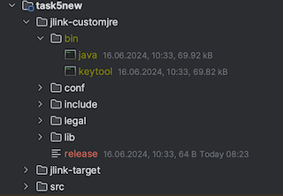

# Homework by the lesson "JDK tools".

## Build project, build package:
```mvn package```

## jlink generate module:
###  Compile module
``` javac -d jlink-target /Users/hellomoto/IdeaProjects/Java-Advanced-homework/matveev/task5new/src/module-info.java ```
   
### Add classes:
```javac -d jlink-target --module-path jlink-target ./src/main/java/homework/Jlink.java```


### Run it:
```java --module-path ./jlink-target --module mymodule/homework.Jlink```

### Output:
```
task5new % java --module-path ./jlink-target --module mymodule/homework.Jlink
Jun 16, 2024 10:31:52 AM homework.Jlink main
INFO: Hello JdkTools
```

### View dependencies:
```jdeps --module-path jlink-target -s --module mymodule```

### Output:
```
task5new % jdeps --module-path jlink-target -s --module mymodule
mymodule -> java.base
mymodule -> java.logging
```

### Create own lightweight jre:
```jlink --module-path "/Users/hellomoto/IdeaProjects/Java-Advanced-homework/matveev/task5new/jlink-target" --add-modules mymodule --output jlink-customjre```



### Run our own app with custom JRE:
```
'absolutePath to jlink-customjre/bin/java' -classpath '$absolutePath to jlink-customjre' --module mymodule/homework.Jlink
Jun 16, 2024 11:07:12 AM homework.Jlink main
INFO: Hello JdkTools
```

## KeyTool:

### Generate cert:
```keytool -genkeypair -alias cert1 -keypass pass123 -validity 365 -storepass stpass123 -keyalg RSA -keystore .\keytool-certs\our_keystore```

### Check it:
keytool -list -storepass stpass123 -keystore .\keytool-certs\our_keystore 

### Detailed info about cert:
```keytool -list -v -alias cert1 -storepass stpass123 -keystore .\keytool-certs\our_keystore```

### Ouput:
```
Alias name: cert1
Creation date: Jun 16, 2024
Entry type: PrivateKeyEntry
Certificate chain length: 1
Certificate[1]:
Owner: CN=Aleksey Matveev, OU=Unknown, O=Unknown, L=Unknown, ST=Unknown, C=Unknown
Issuer: CN=Aleksey Matveev, OU=Unknown, O=Unknown, L=Unknown, ST=Unknown, C=Unknown
Serial number: e4b2898161***
Valid from: Sun Jun 16 11:16:26 MSK 2024 until: Mon Jun 16 11:16:26 MSK 2025
Certificate fingerprints:
         SHA1: 07:B3:A2:74:16:9C:48:C0:C2:71:3B:B2:31:A0:28:74:D7:B4:EF
         SHA256: BD:3F:05:C2:C6:3B:43:7B:C9:78:31:EB:11:74:B8:5A:3F:84:6C:E4:C6:7D:BE:9C:11:F9:C8:44:80:07:B6
Signature algorithm name: SHA384withRSA
Subject Public Key Algorithm: 3072-bit RSA key
Version: 3

Extensions: 

#1: ObjectId: 2.5.29.14 Criticality=false
SubjectKeyIdentifier [
KeyIdentifier [
0000: 7C 4D 66 22 B1 F6 E9 0C   35 CB 06 51 57 6C 62 21  .Mf"....5..QWlb!
0010: DD 18 81 A4                                        ....
]
]

```
### Try to verify  our not signed *.jar :
```
jarsigner -verify '$absolutePath to task5new-1.0.jar'
```

### Output:
```
jar is unsigned.
```

### Sing our *.jar:
```
jarsigner absolute_path_to_task5new-1.0.jar -keystore .\keytool-certs\our_keystore cert1
```

### Verify our signed *.jar again:

```jarsigner -verify /Users/hellomoto/IdeaProjects/Java-Advanced-homework/matveev/task5new/target/task5new-1.0.jar```

### Output:
```
jar verified.

Warning: 
This jar contains entries whose certificate chain is invalid. Reason: PKIX path building failed: sun.security.provider.certpath.SunCertPathBuilderException: unable to find valid certification path to requested target
This jar contains entries whose signer certificate is self-signed.
This jar contains signed entries that are not signed by alias in this keystore.
This jar contains signatures that do not include a timestamp. Without a timestamp, users may not be able to validate this jar after any of the signer certificates expire (as early as 2025-06-16).
POSIX file permission and/or symlink attributes detected. These attributes are ignored when signing and are not protected by the signature.

Re-run with the -verbose and -certs options for more details.

```


