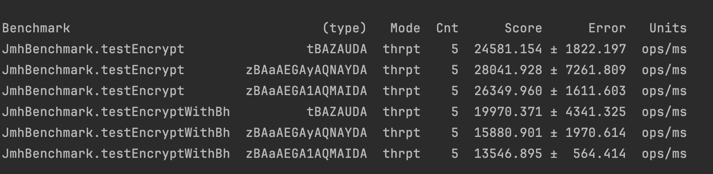

# Homework Java Microbenchmark Harness

## Run benchmark md5/sha256/sha512 algs:
```mvn clean test```

## Result:



## Run JMHSample_11_Loops.java

## Result:


## Run JMHSample_09_Blackholes.java

## Result:


## Run JMHSample_26_BatchSize.java

## Result:
