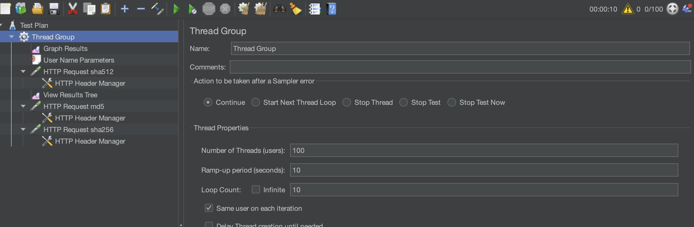
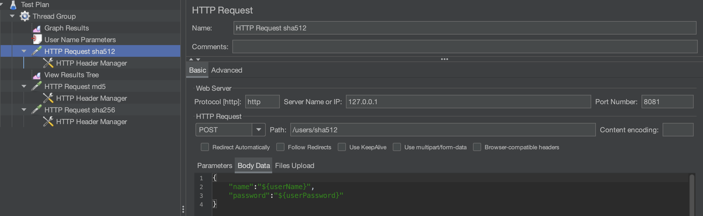
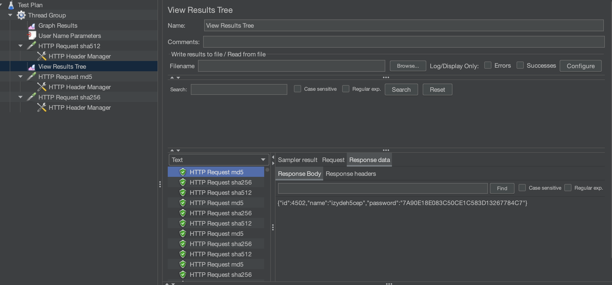
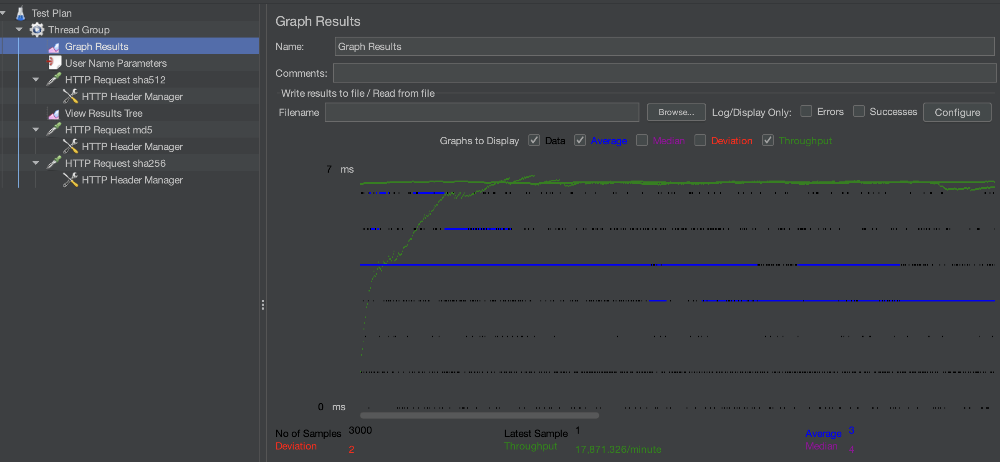
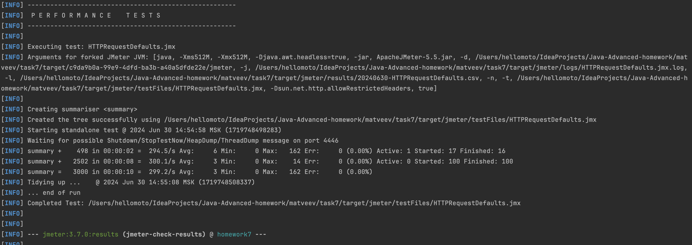
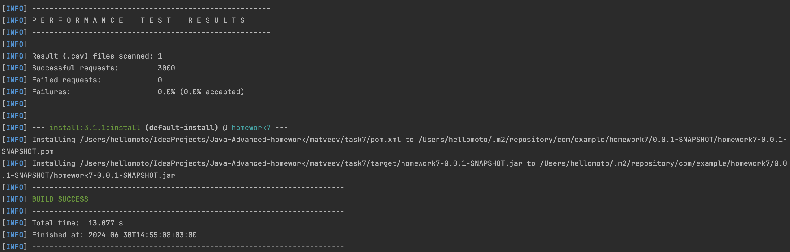

# Homework Jmeter.

## Part 1. Run Jmeter via UI.

###  Load plan:


###  Request data:


### Result tree:


### Result graph:



## Part 2. Run jmeter via maven plugin.

### 1. Run application Homework7Application

### Run performance tests via load profile HTTPRequestDefaults.jmx
```
mvn clean install -P performance-test
```

### Results:

