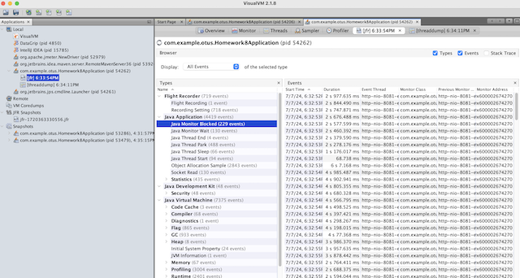

# Homework JFr.

App create users, hash passwords and put it into h2 database.
1) Modifications: made encrypt method synchronized.
2) Added not exist encrypt type to encryptType list (every createUser it takes random value from list).
3) if password too strong(user.getPassword().length() > 5) then throw new IllegalArgumentException("Password is too strong, make it easier");
4) Get users method, uses external db queries to get all users.
```
com/example/otus/controller/UserController.java:20
```

In case when we got notExist encrypt type -> 
```
            default -> {
                Thread.sleep(1000);
                throw new RuntimeException("Encrypt type not found");
            }
```

## Run App.

## Run VisualVM, select our app, and start JFR:


###  Load plan, create u
src/main/resources/HTTP Request Defaults.jmx


### Open JFR dump:


### It shows that some threads is blocked:


### Shows some unexpected exceptions:


### And Thread.sleeps info


### Open the threadDump in VisualVM, there we can check that we have lots of threads are BLOCKED.


### Thread dump and JFrLog in the root of this homework dir.