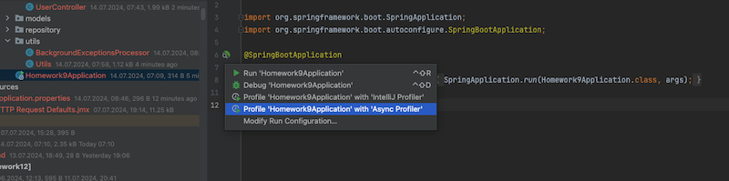
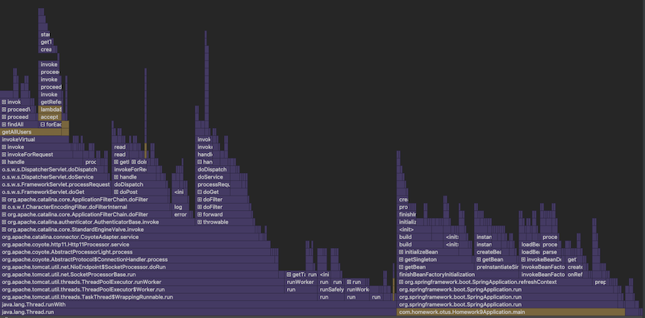
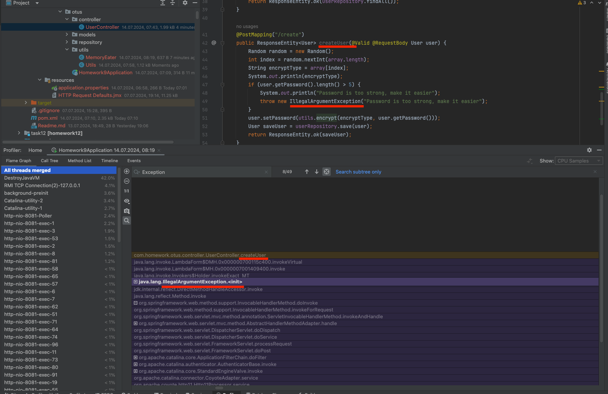
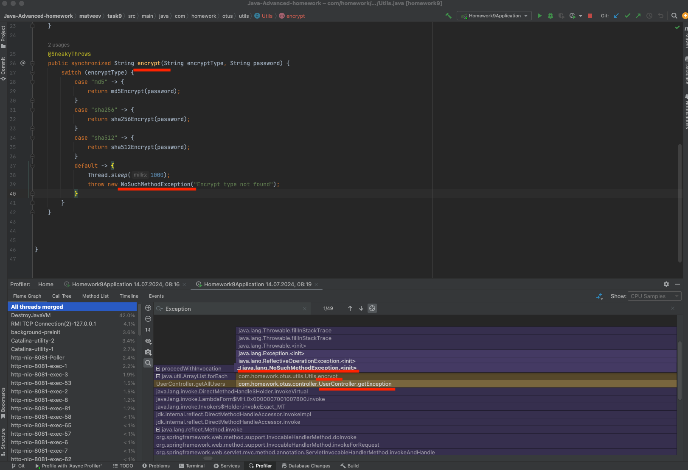
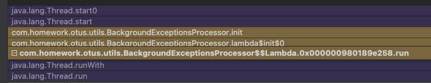
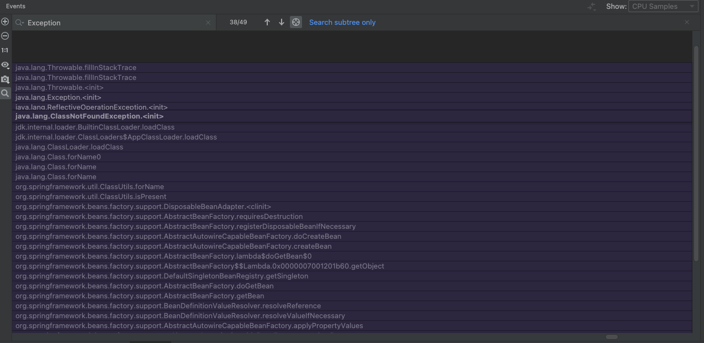
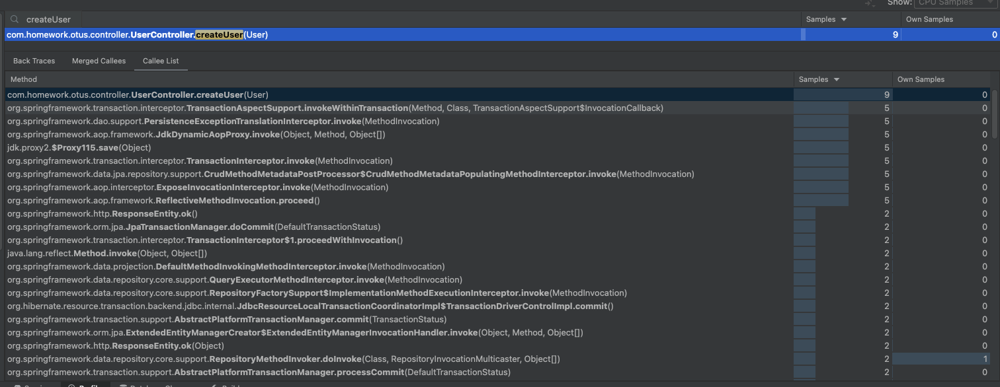
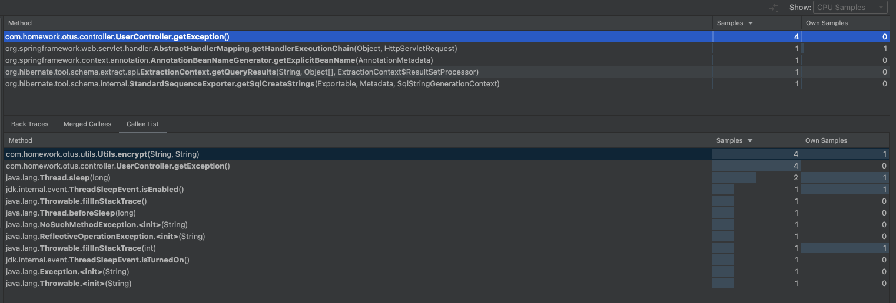

# Homework async Profiler.

App create users, hash passwords and put it into h2 database.
1) Added BackgroundExceptionsProcessor -> throw new NoSuchElementException() every 5 seconds.
2) Controller getException method calls encrypt with not exist encryptType and thrown exception there 

### Run our app with async profiler(async-profiler also comes bundled with IntelliJ IDEA Ultimate 2018.3 and later):

Check that record started.

### Run Load via Jmeter

### Stop recording. Check results.

### Analyze it:
1) Exception in createUser controller:

2) Exception in getException controller:

3) BackgroundExceptionsProcessor:

### Also we found some unexpected issues:

### Get call tree of controller methods: 

