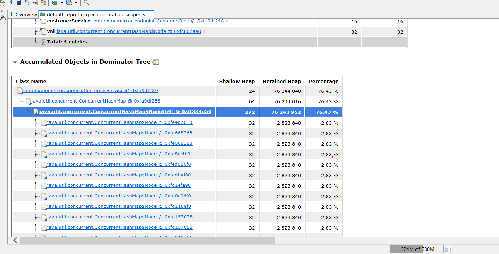

Application to reproduce OutOfMemoryError.  

Java version 17, Gradle, Spring Boot 3.2

Run with vm options: -Xmx100m -XX:+HeapDumpOnOutOfMemoryError
After application started call localhost:8080/customer/login using jmeter to reproduce 
java.lang.OutOfMemoryError: Java heap space.

Heap dump will be created automatically.

# Задание 2
Поиск утечки памяти в приложении
Цель:
Создать тестовой приложение с утечкой памяти и найти её с помощью специальных инструментов

Описание/Пошаговая инструкция выполнения домашнего задания:
1. Реализоавть простое приложение на spring boot:
1.1 Сервис регистрации пользователя в системе: rest service принимающий login и password от пользователя
1.2 Для хранение данных использовать БД H2
1.3 Для доступа к данным использовать Spring JPA
2. Заложить проблему, вызывающую OutOfMemoryError. Примечание: приложение должно постепенно копить мусор в течение нескольких минут
3. Запускать приложение с инструкцией, позволяющей собирать дамп хипа перед падением
4. Провести анализ дампа инструментам Eclipse Memory Analyzer Tool, найти утечку, и предоставить скиншот того места, 
где можно сделать вывод об утечку (с комментариями, поясняющими почему вы считаете это место утечкой)
5. Поправить утечку памяти (отдельным коммитом в пулл реквесте).

P.S. Может показаться, что нужно реализовать лишнее, но данное приложение вы будете использовать в следующих ДЗ, докручивая по заданию.

Критерии оценки:
Написано приложение, которое после запуске падает через несколько минут с дампом памяти
В отчёте есть скриншоты Eclipse Memory Anylizer Tool, указание строк кода приложения и с объяснениями, на основании каких данных сделан вывод об утечке и его место положении.
Статус "Принято" ставится при выполнении всех пунктов

Map занимает большую часть выделенной памяти, это видно в столбце Retained heap, то есть объекты лежашие в
мапе и доступные через нее заняли много места.
