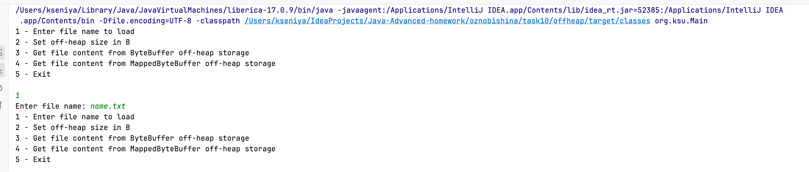
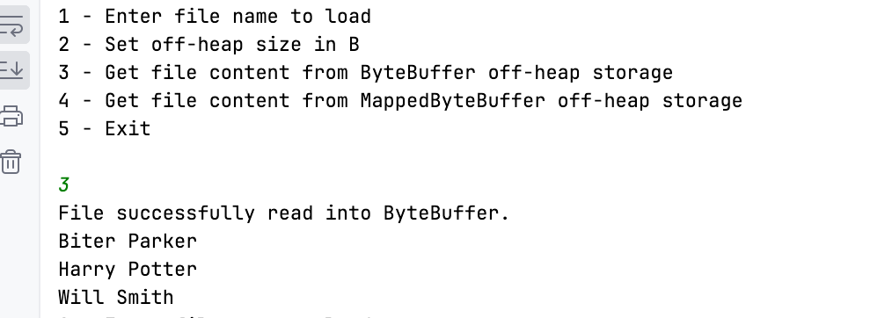
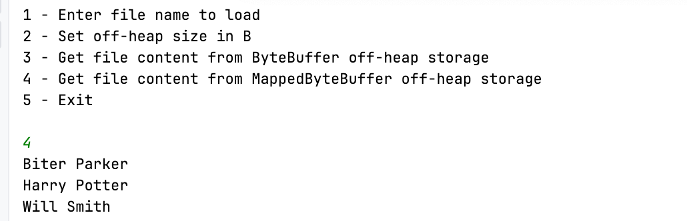

Использование ByteBuffer

Цель:
Реализовать хранение данных в off-heap

Описание/Пошаговая инструкция выполнения домашнего задания:

Реализровать класс для хранения данных в off-heap, используя инструменты
библиотеки Java NIO:ByteBuffer и MappedByteBuffer(обязательные реализации).
Так же можно использовать свое решение, но примеры реализаций с ByteBuffer и MappedByteBuffer обязаетльны.
Данные списываются с файла и записываются в off-heap хранилище.

Пользователь может задавать размер off heap хранилища и вводить название файла. Если файл не найден, то бросается исключение."

Запускаем приложение, задаем имя файла name.txt, дефолтный размер буфера 1024.

Читаем из ByteBuffer

Читаем из MappedByteBuffer

