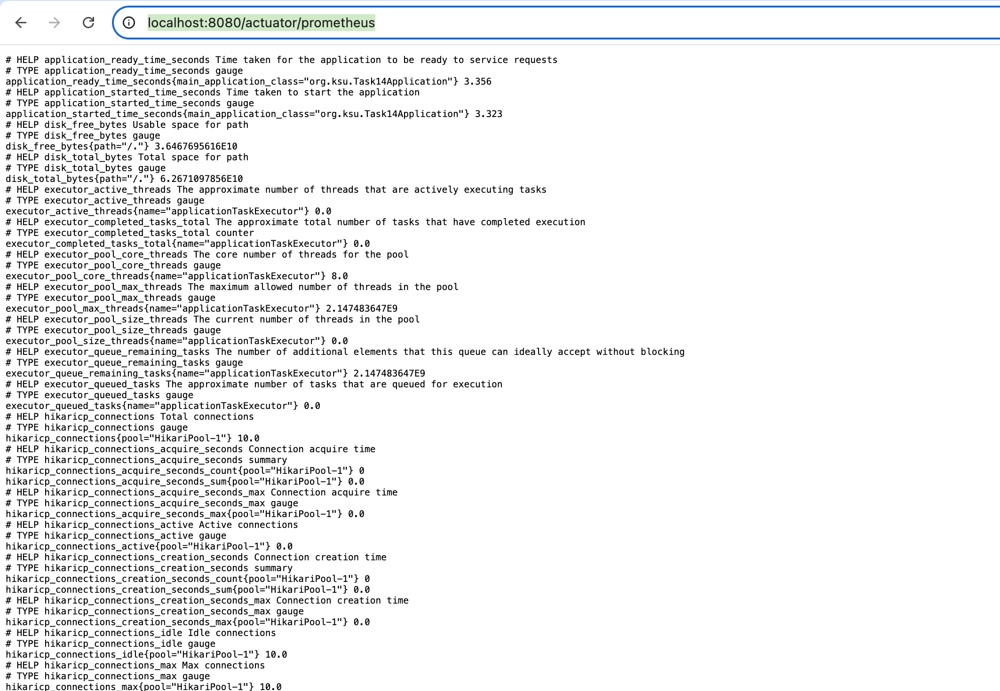

Домашнее задание
Создать метрики для отслеживания нагрузки на Rest сервис

Цель:
Покрыть Rest сервис метриками, построить дашборд к Grafana и продемонстрировать результаты дашборда, подавая нагрузку через JMeter

запуск контейнеров с grafana, prometheus, metrics-app
docker-compose -p otus up -d

http://localhost:8080/actuator/prometheus

Peometheus

Grafana - дашборд добавленный в конфигурации infra/grafana/dashboards/otus.json

## Update
Latency

Errors

## Update
Latency

Errors

RPS,RPM
