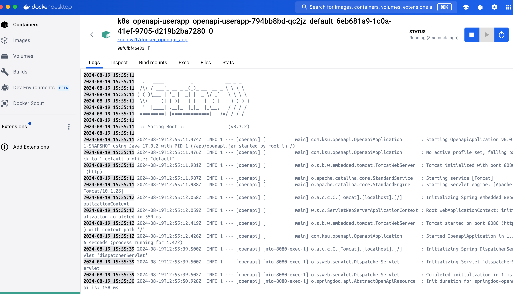
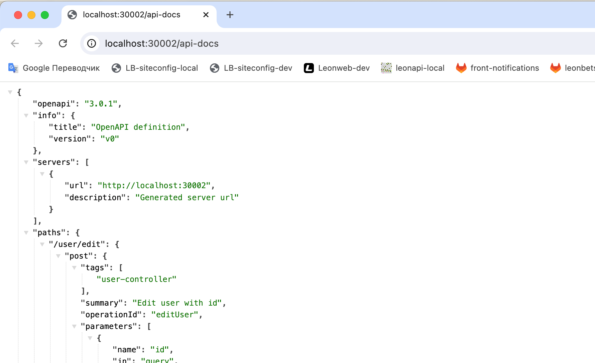
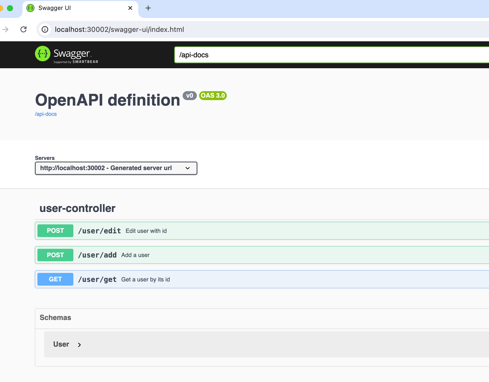
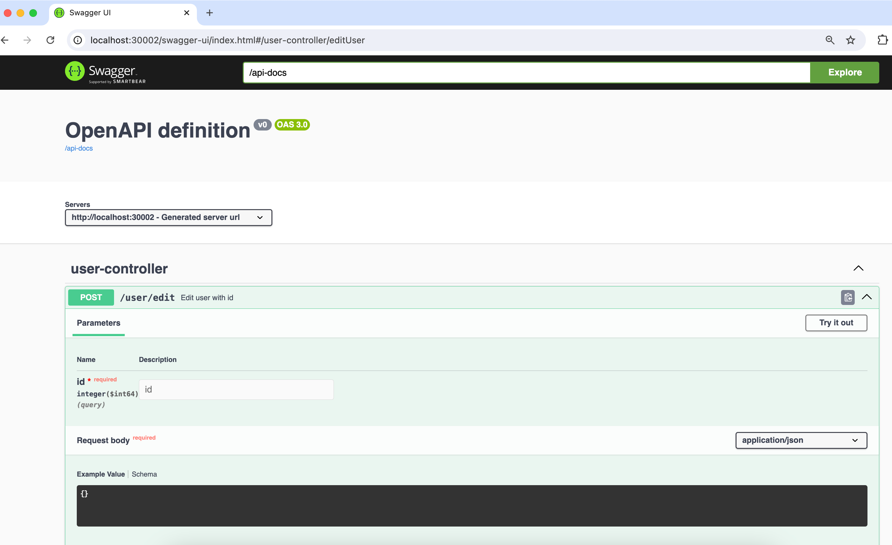

## Домашнее задание
Описать Rest сервис с помощью OpenAPI

Цель:
Описать Rest сервис с помощью OpenAPI и продемонстрировать работу в Kubernetes (деплой через Helm)

### Описание/Пошаговая инструкция выполнения домашнего задания:
Подключить OpenAPI в проект
Описать пустое (stub) API со следующими эндпойнтами:
POST /user/add (принимает произвольный JSON)
POST /user/edit?id= (принимает произвольный JSON)
GET /user/get?id= (возвращает произваольный JSON)
Настроить эндпойнт для OpenAPI по адресу /api-docs
Подключить SwaggerAPI и замапать его на /api-docs-ui

## Выполнение
Создать image и запушить в docker repository:

> docker build -t docker_openapi_app .

> docker tag docker_openapi_app kseniya1/docker_openapi_app  // (переименовать иначе будет ошибка при пуше)
>
> docker push kseniya1/docker_openapi_app

Деплой в kubernetes:
> helm upgrade --install openapi-userapp --values ./openapi/values.yaml ./helm

Запущенное приложение в kubernetes:

http://localhost:30002/api-docs
 

http://localhost:30002/api-docs-ui

