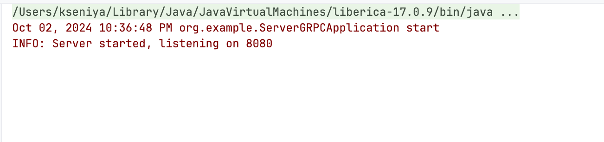
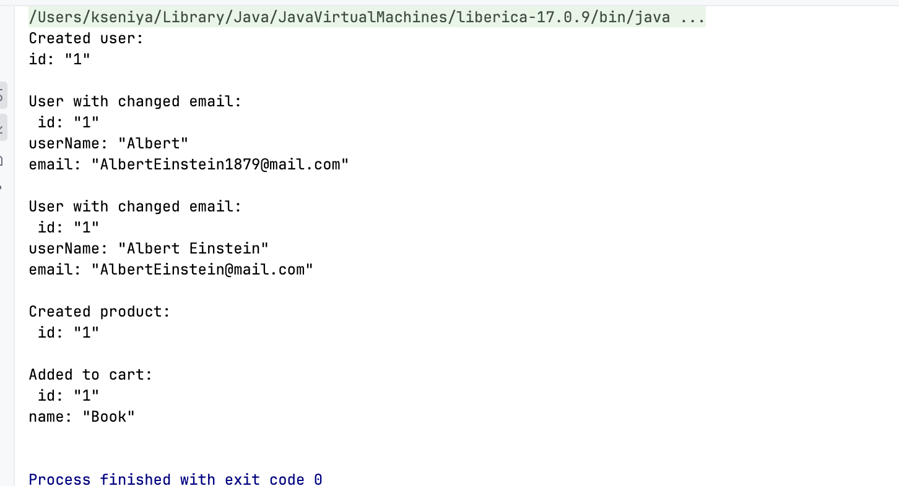

### Домашнее задание
Описать gRPC сервис

Цель:
Описать gRPC сервис и приложить скриншоты вывода консоли в пул реквест (вместе с рабочим кодом)

Описание/Пошаговая инструкция выполнения домашнего задания:
Подключить gRPC в проект
Описать сущности при помощи protobuf:
User (email, username, id)
Product (name, id)
Описать сервис при помощи protobuf:
createUser(email, username) returns id
changeUserEmail(id, email)
changeUserName(id, username)
createProduct(name) returns id
addProductToCart(usderId, productId)
Реализовать сервис в Java

Критерии оценки:
Критерии оценки:
Все сущности и сервис реализованы правильно
Проект должен собираться без ошибок а protobuf генерировать сущности и интерфейсы
Есть скриншоты вывода консоли

Define a service in a .proto file
Generate server and client code using the protocol buffer compiler
Create the server application, implementing the generated service interfaces and spawning the gRPC server
Create the client application, making RPC calls using generated stubs

Сгенерировать код из proto файла:
mvn clean install

Запускаем сервер

Запускаем клиент 
