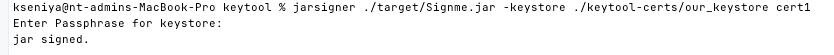
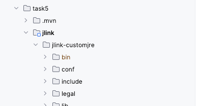
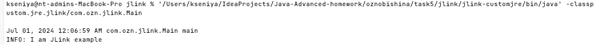

Задание по jvm tools
1) keytool & jarsigner
   Выпустить самоподписанный сертификат, подписать им jar-файл(из одного класса с методом main()), верифицировать подпись
2) jlink
   Написать класс с одним методом main(), и из него собрать custom lighthweight jre, и запустить свою программу с помощью этой jre

Сделать скриншоты выполненной работы, запушить в виде отчета в репо с ДЗ

# 1) keytool & jarsigner

#### Generate certificate
```
keytool -genkeypair -alias cert1 -keypass pass123 -storepass stpass123 -validity 365 -keyalg RSA -keystore ./keytool-certs/our_keystore
```


Look at the certificate
`keytool -list -storepass stpass123 -keystore ./keytool-certs/our_keystore `
`keytool -list -v -alias cert1 -storepass stpass123 -keystore ./keytool-certs/our_keystore` 

#### Sign jar
```
jarsigner -verify ./target/Signme.jar
jarsigner ./target/Signme.jar -keystore ./keytool-certs/our_keystore cert1
```


#### Verify signature
```
jarsigner -verify ./target/Signme.jar ./keytool-certs/our_keystore cert1
```


# 2) jlink

#### Compile and run

`javac -d jlink-target ./src/main/java/module-info.java `         - compile module

```javac -d jlink-target ./src/main/java/com/ozn/jlink/Main.java```    - add all needed classes into module

```java --module-path jlink-target --module <module name>/<main module class>```    -run module, check it works
```java --module-path jlink-target --module java.custom.jre.jlink/com.ozn.jlink.Main```

#### Use jdeps to check dependencies
```
jdeps --module-path jlink-target -s --module java.custom.jre.jlink
```

#### Create own lightweight jre
```jlink [options] -module-path modulepath --add-modules module [, module] --output <target directory>```
```
jlink --module-path "/Users/kseniya/IdeaProjects/Java-Advanced-homework/oznobishina/task5/jlink/jlink-target:/Users/kseniya/Library/Java/JavaVirtualMachines/liberica-17.0.9/jmods" --add-modules java.custom.jre.jlink --output jlink-customjre
```


#### Run jre
```jlink-customjre/bin/customjrelauncher.bat``` - for Windows

```
'/Users/kseniya/IdeaProjects/Java-Advanced-homework/oznobishina/task5/jlink/jlink-customjre/bin/java' -classpath '$/Users/kseniya/IdeaProjects/Java-Advanced-homework/oznobishina/task5/jlink/jlink-customjre' --module java.custom.jre.jlink/com.ozn.jlink.Main
```
