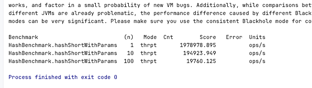

1. Использовать приложение из предыдущих заданий. Для выполнения задания потребуется сервис регистрации пользователя, реализованный ранее.
2. Добавить в сервис регистрации логику по хешированию пароля с последующим сохранением хеша в БД
3. Реализовать несколько тестов по производительности:
    - тест на логику хэширвования пароля с применением 3 разных алгоритмов: Md5, sha256, sha512 (возможно, в качестве параметра использовать число итераций) - чтобы была сравнительная статистика. Чтобы обоснованно выбрать для сервиса менее тяжелый вариант
    - \* тест на общий сервис регистрации клиента (без учёта инициализации spring, траспорта http rest)
4. Замерить все доступные в JMH метрики: Throughput, AverageTime, SampleTime, SingleShotTime
5. Выбрать 3 различых теста от https://hg.openjdk.org/code-tools/jmh/file/tip/jmh-samples/src/main/java/org/openjdk/jmh/samples/ и предоставить отчёт о запуске этих тестов.

Добавлена логика по хэшированию пароля.

Сравнение работы разных алгоритмов хэширования пароля:

Тест с разным числом итераций:

Отчеты по тестам из ссылки в файлах:  
JMHSample_17_SyncIterations.txt, 
JMHSample_27_Params.txt
JMHSample_27_Params.txt