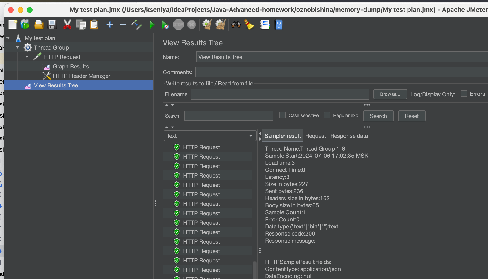
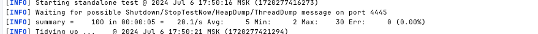
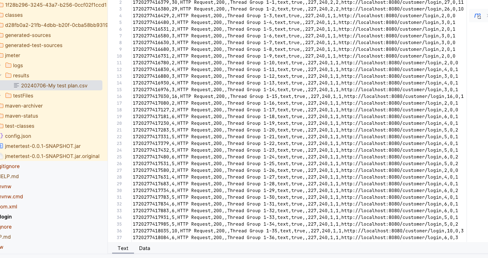

Для выполнения задания потребуется сервис регистрации пользователя, реализованный ранее.
Создать тестовый план с регулиремым RPS.
1)Сделать тесты через UI-ный интерфейс Jmetera
2)Сделать тесты через отдельный подмодуль с библиотекой Jmeter.
При старте данного подмодуля jar должен запускаться и генерировать нагрузку на основное приложение
Скриншоты положить в папку и пушить всё в одном PR

### Тесты через UI-ный интерфейс Jmetera


### Тесты через отдельный подмодуль с библиотекой Jmeter

Запуск тестов командой:
`````
mvn verify
```




