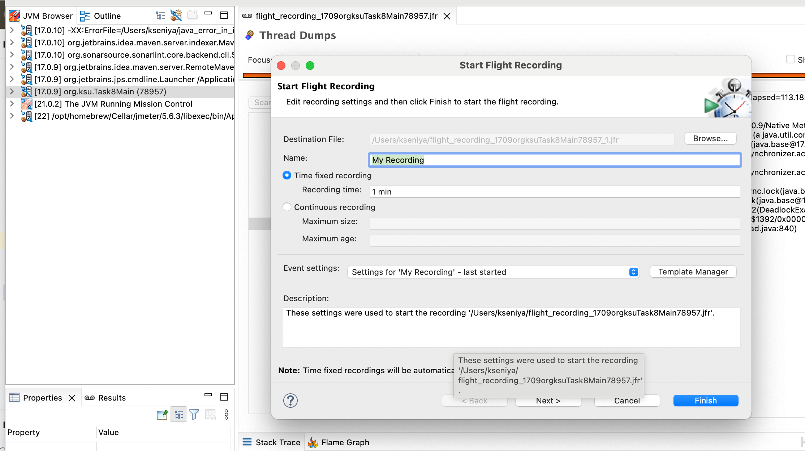

Домашнее задание
Диагностика приложения с помощью JFR

Цель:
Реализовать тестовый пример, содержащий проблемы, которые потом продемонстрировать в JFR

Описание/Пошаговая инструкция выполнения домашнего задания:

1) Для выполнения задания потребуется сервис регистрации пользователя, реализованный ранее.
2) Написать тестовый профиль с использованием JMeter
3) Провести профилирование приложения с помощью JFR
4) Имитировать проблемы в приложении (одну на выбор):
- лишние исключения
- лишние запросы в БД
- ненужные блокировки synchronized или Lock
- свои варианты
5) На основе анализа журнала JFR найти проблемы в приложении и обосовать, как прийти к такому 
заключению о проблемах. В отчёт можно включать скрини JMC, ссылки на исходный код."

В дампе потока видно что он ожидает блокировку

