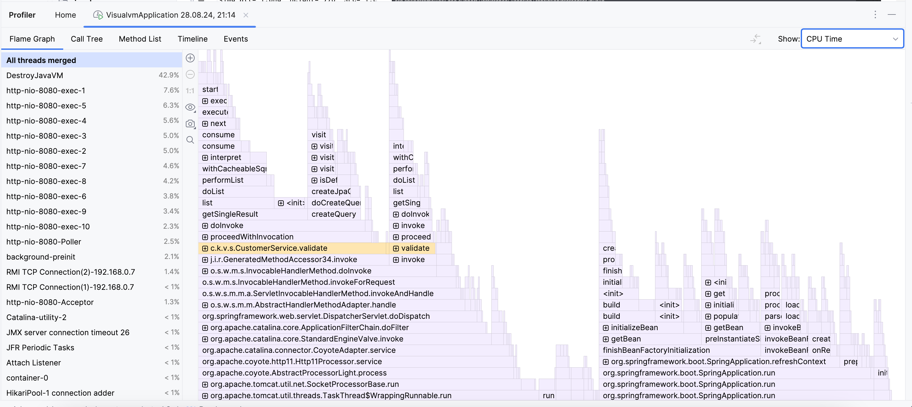

## Задание

Реализовать тестовый пример, содержащий проблемы, которые потом продемонстрировать в visualvm

Описание/Пошаговая инструкция выполнения домашнего задания:
Для выполнения задания потребуется сервис регистрации пользователя, реализованный ранее.
Написать тестовый профиль с использованием JMeter
Провести профилирование приложения с помощью jvisualvm
Имитировать проблемы в приложении (одну на выбор):
лишние исключения
лишние запросы в БД
ненужные блокировки synchronized или Lock
свои варианты
В readme.md-отчёт приложить flame graph от asyncProfiler'а. Описать словами, где видно подозрение на проблемы с производительностью

Запускаем приложение, запускаем серию тестов в Jmeter, запускаем profiler jvisualvm.

Видим что метод validate выполняется очень занимает много времени.

Смотрим на работу потока и видим, что опять метод validate выполняется очень долго. 
Это неудивительно, ведь мы ходим в бд 100 раз из этого метода
com.ksu.visualvm.service.CustomerService.validate

На flame graph также видно, что в validate заходим часто.
