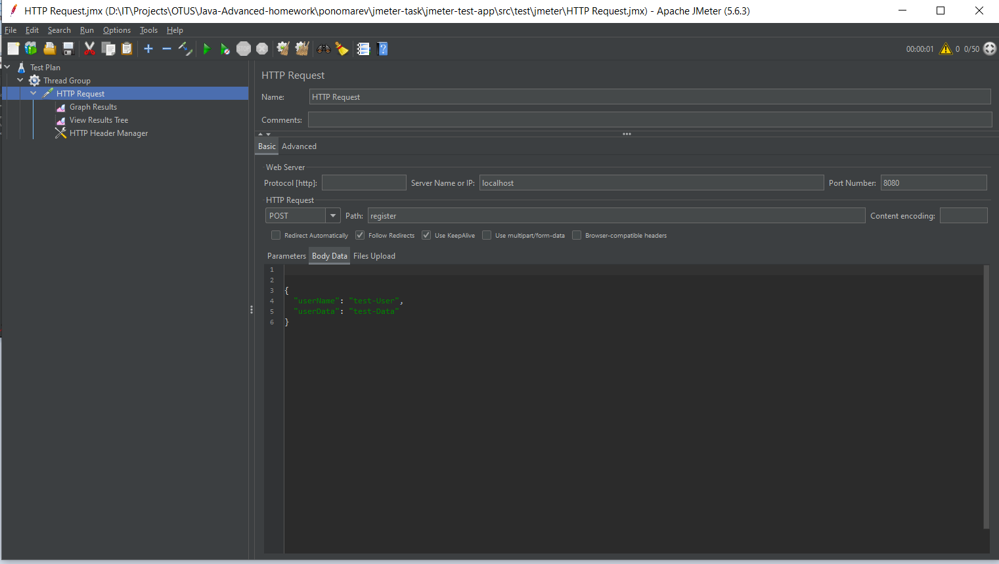
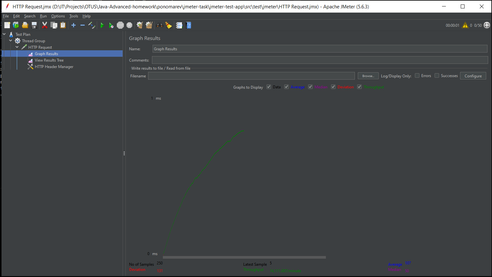
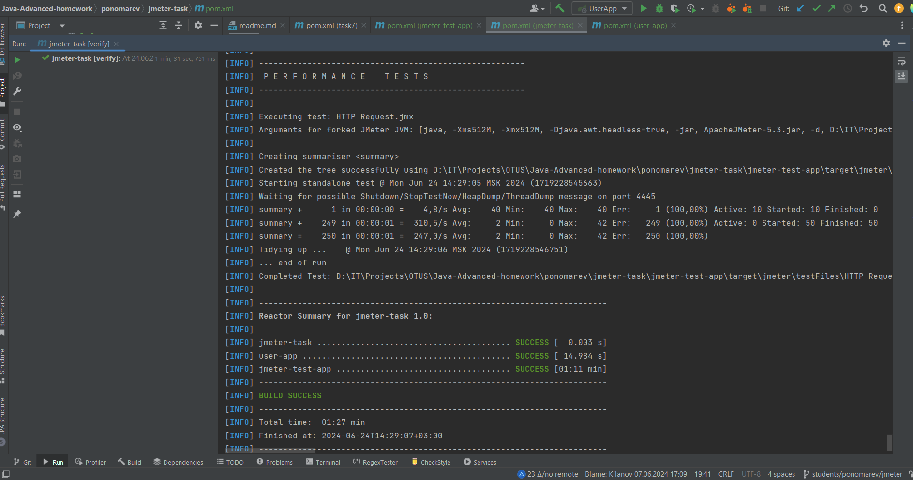

# Реализовать генератор нагрузки

- Модуль-приложение для регистрации пользователей и сохранения их данных в H2 на SpringBoot.
- Модуль-приложение для нагрузочного тестирования выбранного протокола с помощью Apache Jmeter.

При запуске mvn verify модуль тестирования начинает отправку запросов на регистрацию пользователя по заранее
подготовленному тестовому плану

### Project conf:

JDK 17, Maven, SpringBoot, Apache Jmeter

* [Official Apache Maven documentation](https://maven.apache.org/guides/index.html)
* [Spring Boot Maven Plugin Reference Guide](https://docs.spring.io/spring-boot/docs/3.2.5/maven-plugin/reference/html/)
* [Create an OCI image](https://docs.spring.io/spring-boot/docs/3.2.5/maven-plugin/reference/html/#build-image)
* [Spring Data JPA](https://docs.spring.io/spring-boot/docs/3.2.5/reference/htmlsingle/index.html#data.sql.jpa-and-spring-data)
* [Spring Web](https://docs.spring.io/spring-boot/docs/3.2.5/reference/htmlsingle/index.html#web)

### Отчет

* использовано приложение для регистрации пользователя из прошлых заданий
* реальзованы тесты в UI-ном интерфейсе Apache Jmeter-a:
  
* при запуске приложения user-app и тестов получен положительный результат:
  
* при запуске mvn verify получен положительный результат:
  

