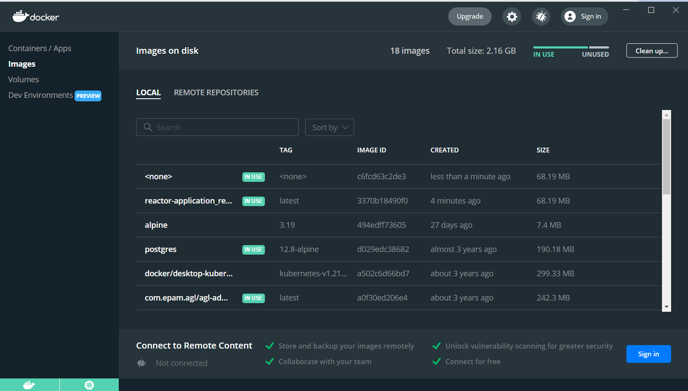

# Реализация сервиса с использование реактивного подхода

Приложение на SpringBoot с использованием реактивного подхода(Задание 11).

### Project conf:

JDK 17, Maven, SpringBoot, Spring Web Flux, JMH

* [Official Apache Maven documentation](https://maven.apache.org/guides/index.html)
* [Spring Boot Maven Plugin Reference Guide](https://docs.spring.io/spring-boot/docs/3.2.5/maven-plugin/reference/html/)
* [Create an OCI image](https://docs.spring.io/spring-boot/docs/3.2.5/maven-plugin/reference/html/#build-image)
* [Spring Data JPA](https://docs.spring.io/spring-boot/docs/3.2.5/reference/htmlsingle/index.html#data.sql.jpa-and-spring-data)
* [Spring Web](https://docs.spring.io/spring-boot/docs/3.2.5/reference/htmlsingle/index.html#web)

### Отчет

* Реализовано приложение с использованием Spring Web Flux
* В приложение добавлены эндпоинты и оно запускается в Docker (задание 12)

