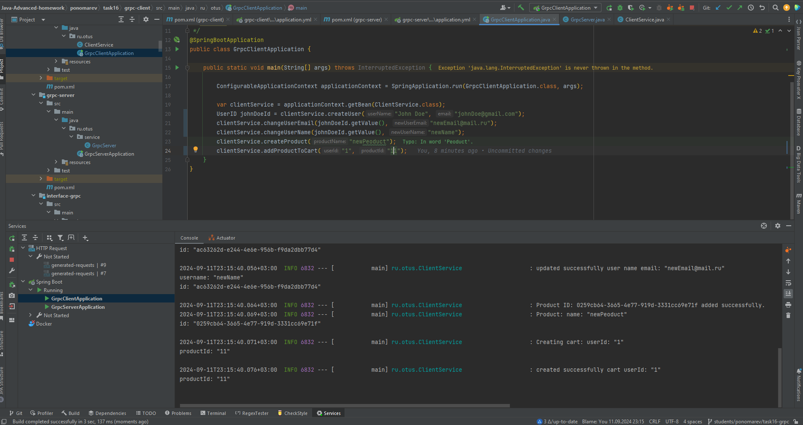

# Задание 16 Описать gRPC сервис

Приложение на SpringBoot c реализацией gRPC.

### Project conf:

JDK 17, Maven, SpringBoot, gRPC, protobuf 

* [Official Apache Maven documentation](https://maven.apache.org/guides/index.html)
* [Spring Boot Maven Plugin Reference Guide](https://docs.spring.io/spring-boot/docs/3.2.5/maven-plugin/reference/html/)
* [Create an OCI image](https://docs.spring.io/spring-boot/docs/3.2.5/maven-plugin/reference/html/#build-image)
* [Spring Data JPA](https://docs.spring.io/spring-boot/docs/3.2.5/reference/htmlsingle/index.html#data.sql.jpa-and-spring-data)
* [Spring Web](https://docs.spring.io/spring-boot/docs/3.2.5/reference/htmlsingle/index.html#web)

### Отчет

* Реализовано описаие gRPC сервиса
Для запуска требуется произвести команду "mvn clean install" для генерации protobuf сущностей и интерфейсов
* Скриншот ниже:
Логи GRPC Server:

Логи GRPC Client:

