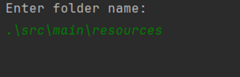
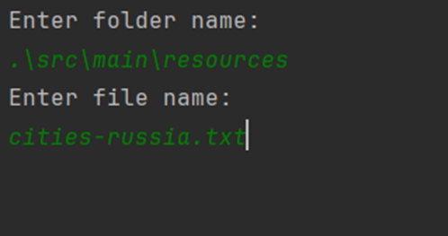
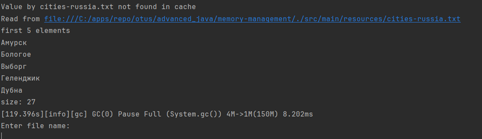

Программа эмулирующая поведение кэша.
При запуске будет запрошена директория с файлами.

После успешной валидации директории будет запрошено имя файла.

Если файл будет найден, то на экран будет выведено первые 5 строк и их общее количество
