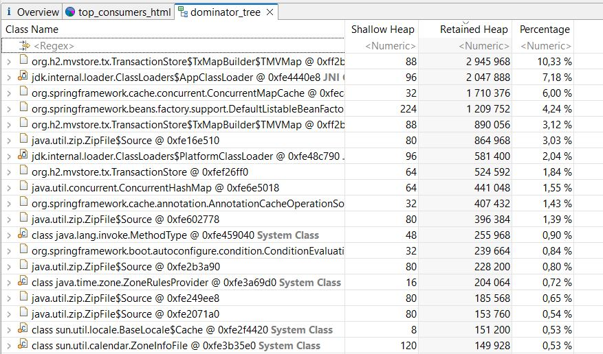

Поиск утечки памяти в приложении.
Моя цель показать утечку через внутренний кеш приложения

Проведено 3-ти теста.
Генерация искусственных данных находится в классе UserGeneratorController.java

1. Запуск приложения с отсутствующим пользовательским кешом.
   Цель: изучить дамп приложения, в результате переполнения кеша h2


2. Запуск приложения с пользовательским кешом на базе ConcurrentHashMap

   ```
   user-cache.type=concurrent-map
   ```

   
   
   
   
   На скринах видно, что появились новые разделы связанные с ConcurrentHashMap

3. Запуск приложения с пользовательским кешом на основе Caffeine
   ```
   user-cache.type=caffeine
   user-cache.caffeine.maximumSize=100000
   user-cache.caffeine.expireAfterAccessInMinutes=10
   ```
   
