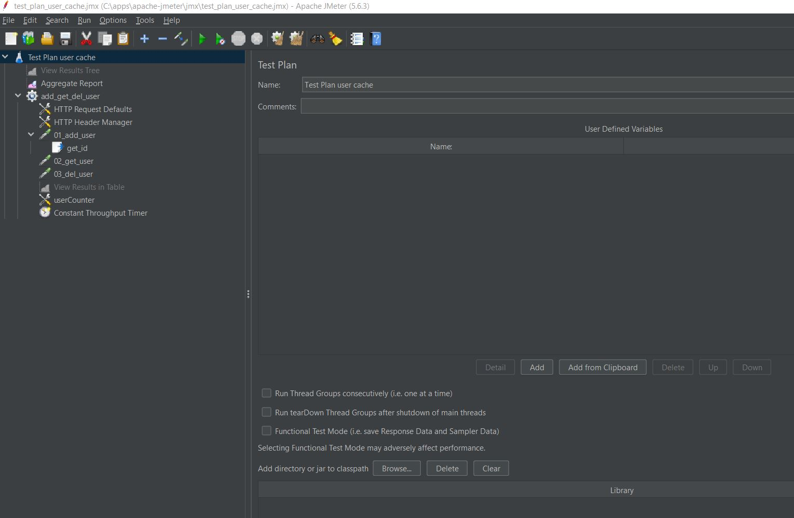
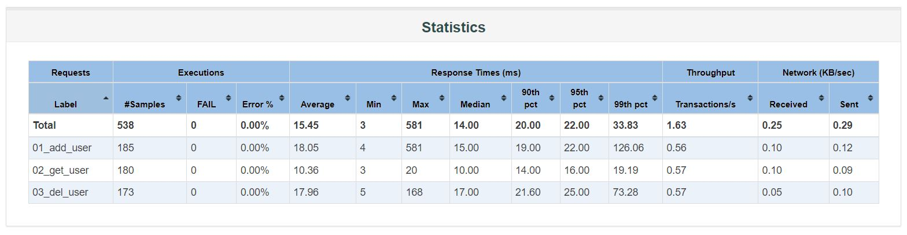
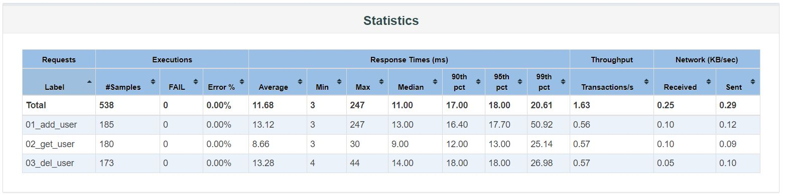

Генератор нагрузки для выбранного протокола

1. Тест через UI-ный интерфейс Jmeter'a
   
   


2. Тест через отдельный подмодуль с библиотекой Jmeter

   ```
   mvn spring-boot:run -f task2/pom.xml
   mvn clean verify -pl task7 "-Djmeter.skipTests=false"
   ```

   
      

