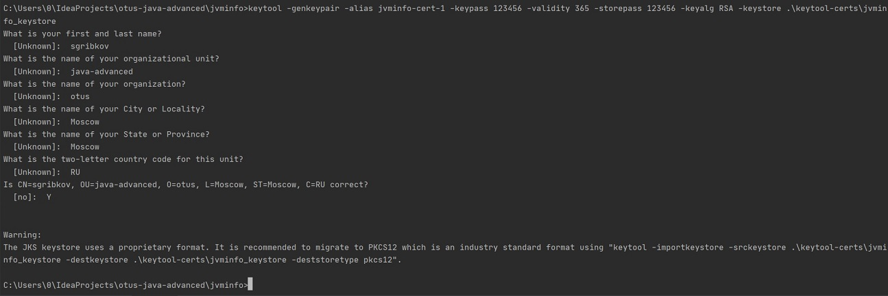
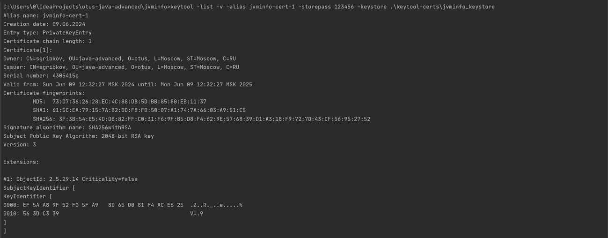
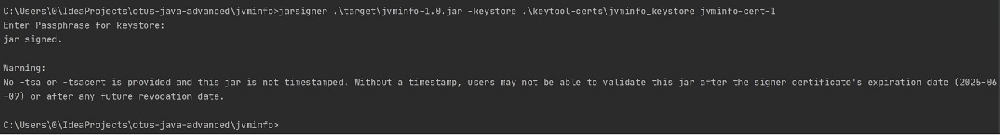
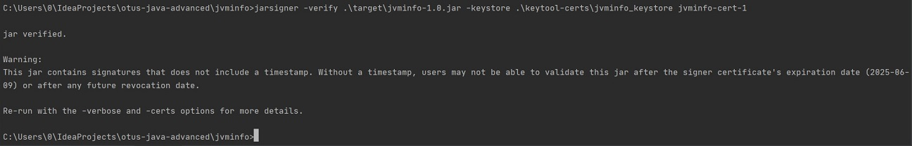
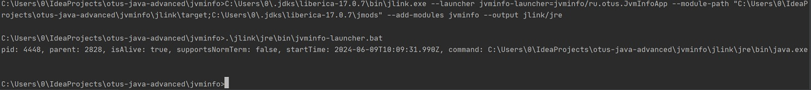

# Приложение для получения информации о процессах java.
#### подписанное сертификатом и запускаемое с помощью специально созданной JRE

Приложение позволяет получить информацию о процессах java.
После запуска в консоль выводится информация о каждом таком процессе:
* pid
* parent pid
* isAlive
* supportsNormalTermination
* startTime
* command

## Подпись

### Создание сертификата

*keytool -genkeypair -alias jvminfo-cert-1 -keypass 123456 -validity 365 -storepass 123456 -keyalg RSA -keystore .\keytool-certs\jvminfo_keystore*

### Просмотр сертификата

*keytool -list -v -alias jvminfo-cert-1 -storepass 123456 -keystore .\keytool-certs\jvminfo_keystore*

### Подпись JAR

*jarsigner .\target\jvminfo-1.0.jar -keystore .\keytool-certs\jvminfo_keystore jvminfo-cert-1*

### Верификация JAR

*jarsigner -verify .\target\jvminfo-1.0.jar -keystore .\keytool-certs\jvminfo_keystore jvminfo-cert-1*

## JRE

### Компиляция приложения

*javac -d ./jlink/target ./src/main/java/module-info.java*

*javac -d ./jlink/target --module-path ./jlink/target ./src/main/java/ru/otus/JvmInfoApp.java*

### Создание JRE

*jlink --launcher jvminfo-launcher=jvminfo/ru.otus.JvmInfoApp --module-path "C:\Users\0\IdeaProjects\otus-java-advanced\jvminfo\jlink\target;C:\Users\0\.jdks\liberica-17.0.7\jmods" --add-modules jvminfo --output jlink/jre*

### Запуск

*.\jlink\jre\bin\jvminfo-launcher.bat*

Выведенная в консоль информация демонстрирует, что приложение было запущено на созданной JRE.