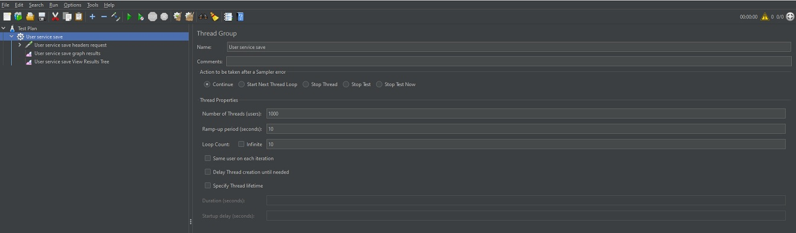
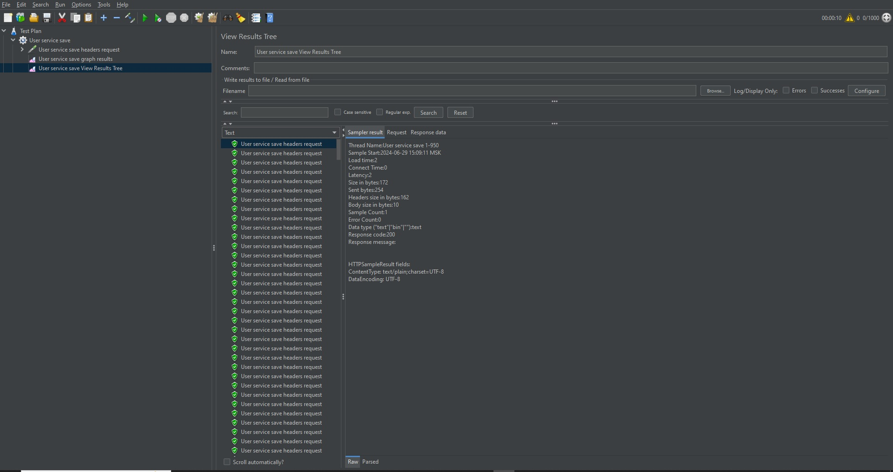
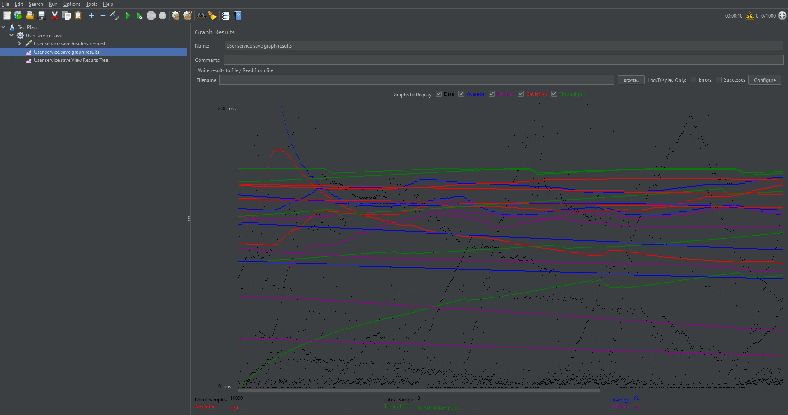
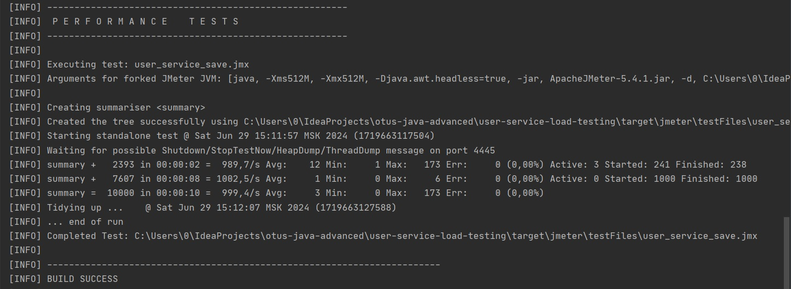

# Нагрузочное тестирование сервиса регистрации пользователей с помощью JMeter

Проведено нагрузочное тестирование сервиса регистрации пользователей для процесса сохранения нового пользователя.

## Параметры плана тестирования
* Количество пользователей: 1000
* Запуск запросов всех пользователей: в течение 10 секунд
* Количество повторений: 10

[План тестирования прилагается](src/test/jmeter/user_service_save.jmx)

## Результаты тестирования

### С помощью приложения JMeter

#### Запуск

#### Результат

### С помощью разработаного модуля JMeter

#### Запуск

*mvn clean verify*

#### Результат

[Сгенерированный отчет прилагается](results/20240629-user_service_save.csv)
