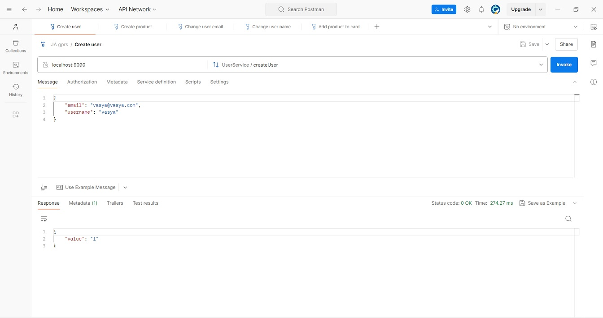
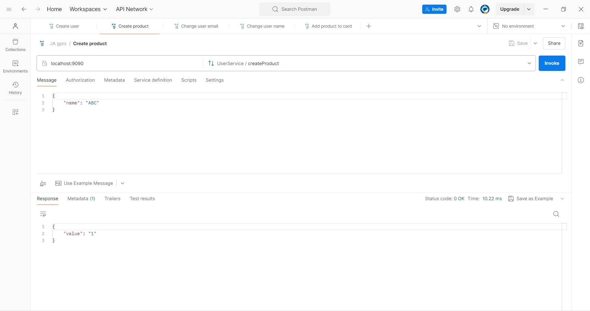
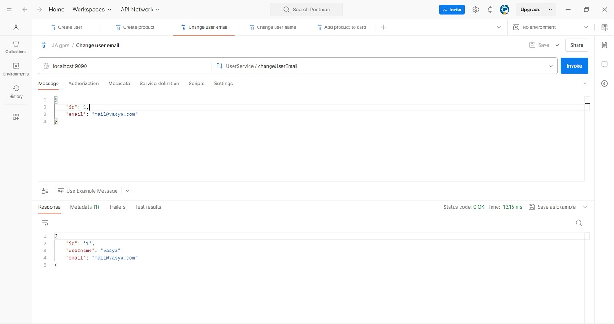
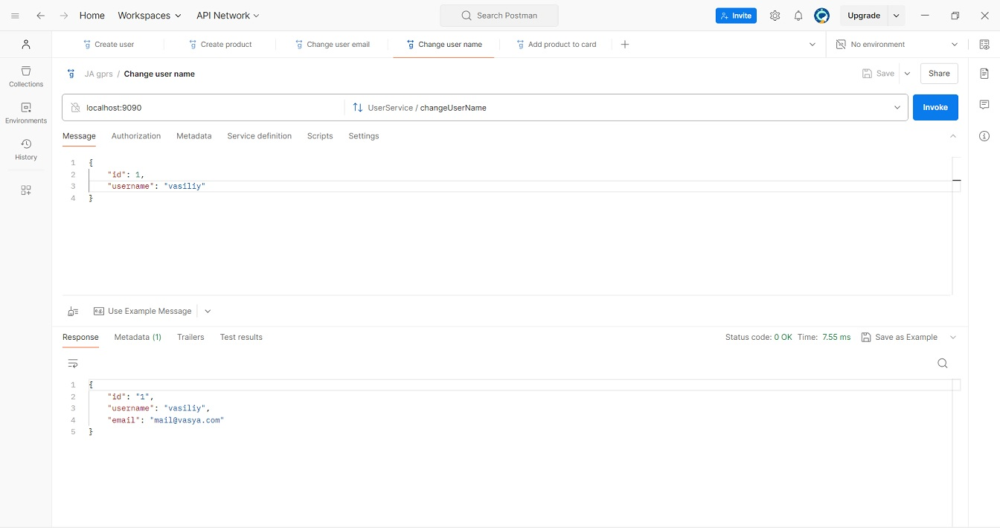
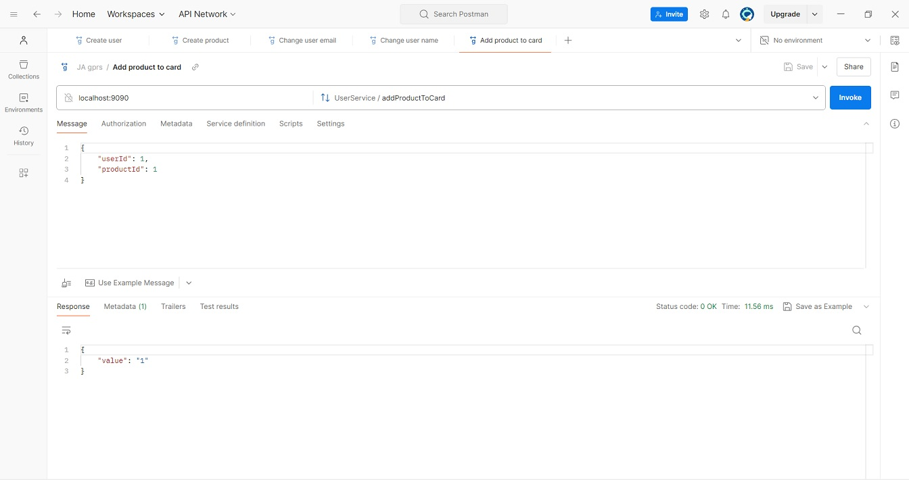
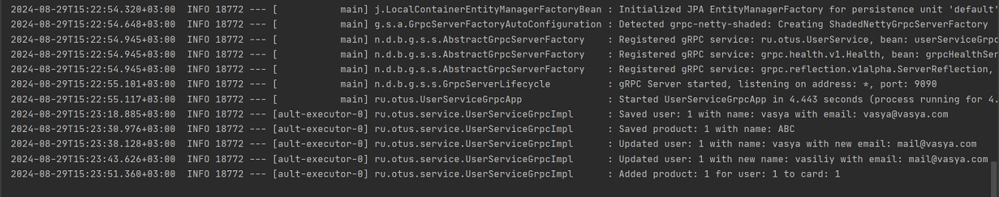

# Сервис для работы с данными пользователей и продуктов с использованием gRPC

Приложение на spring boot с использованием gRPC для работы с данными пользователей и продуктов.
В проект добавлена зависимость ru.otus.user-service-proto-common для использования классов GRPC сервисов, сгенерированных ранее.

## Запуск
*java -jar users-service-proto-server-0.1.jar* 

## Методы сервиса и демонстрация их работы

В качестве gRPC клиента использовался Postman 

#### Добавление нового пользователя

#### Добавление нового продукта

#### Изменение адреса электронной почты пользователя

#### Изменение имени пользователя

#### Добавление продукта в карту пользователя 

#### Логи

Результаты выполнения перечисленных выше методов в указанном порядке

