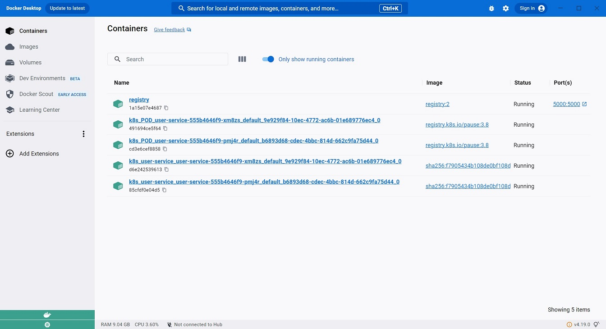
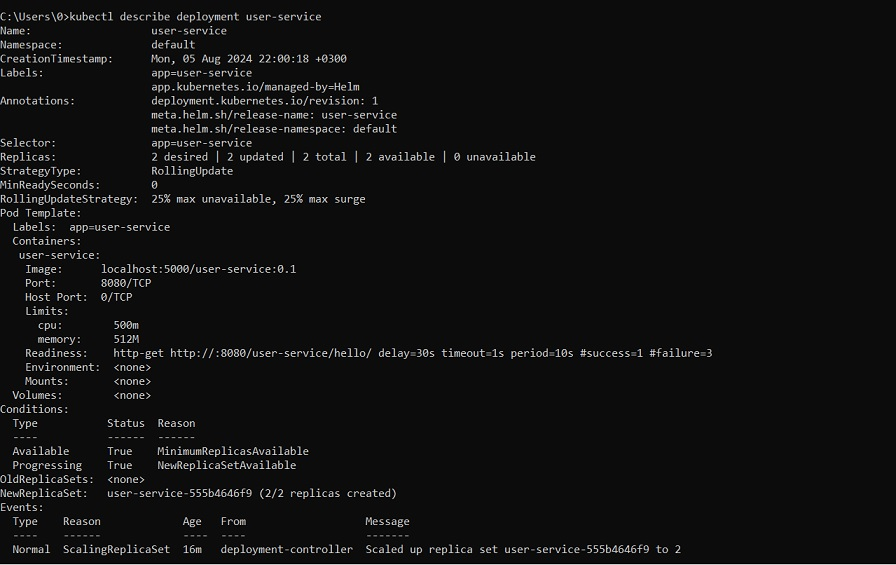
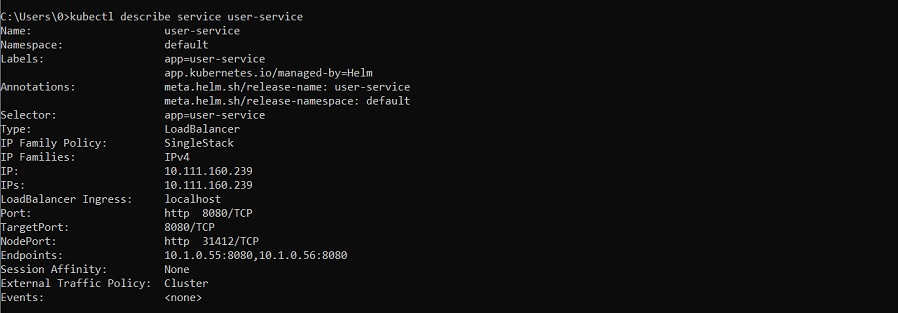
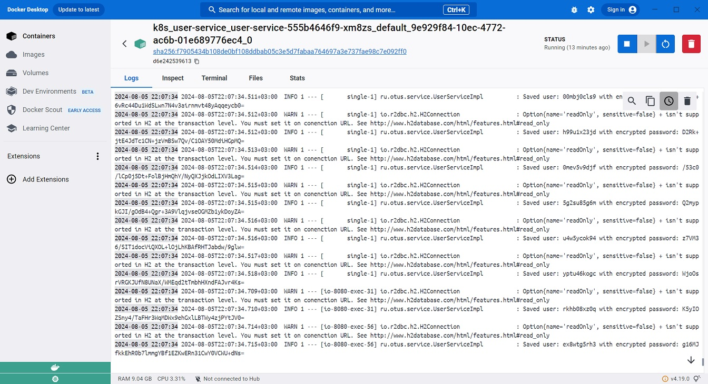
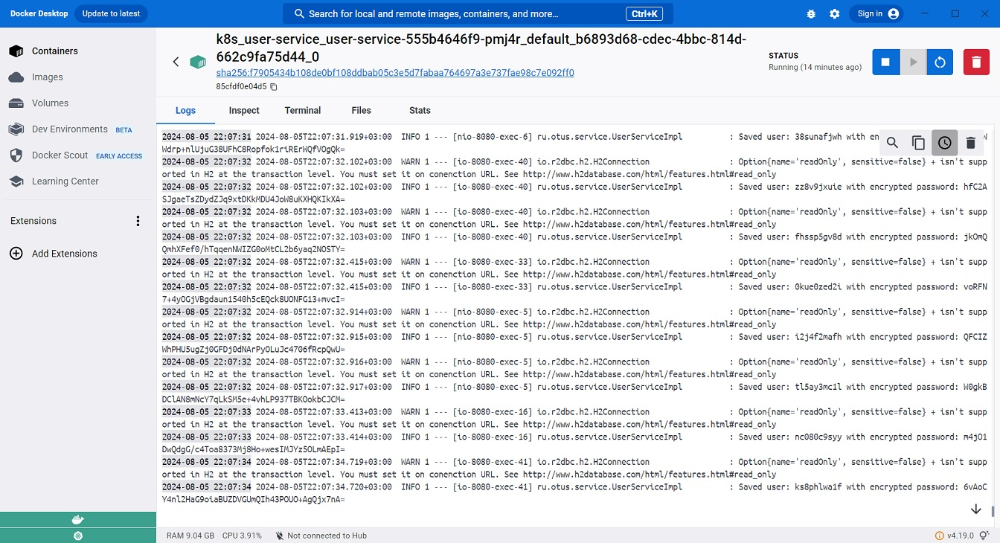

# Развертывание сервиса регистрации пользователей в кластере Kubernetes

Проведено развертывание сервиса регистрации пользователей в кластере Kubernetes с использованием helm chart.
 
Для обеспечения надежности развернуто два экземпляра сервиса с балансировкой трафика.
 
Для проверки готовности сервиса принимать запросы пользователей добавлена readiness probe 
с HTTP GET запросом /user-service/hello/

## Предварительные работы

Развернут контейнер registry и зарегистрирован образ сервиса регистрации пользователей

*docker run -d -p 5000:5000 --restart=always --name registry registry:2*
 
*docker build -t user-service .*
 
*docker tag user-service localhost:5000/user-service:0.1*
 
*docker push localhost:5000/user-service:0.1*

## Развертывание

Создан helm chart с шаблонами service и deployment. 
 
[helm chart прилагается](./user-service)

Проведено развертывание сервиса:
 
*helm install user-service ./deployment/user-service*

### Проверка результатов развертывания

  
*kubectl describe deployment user-service*

  
*kubectl describe service user-service*

### Проверка работы сервиса

Проведено нагрузочное тестирование сервиса регистрации пользователей для процесса сохранения нового пользователя.

Параметры плана тестирования:
* Количество пользователей: 1000
* Запуск запросов всех пользователей: в течение 10 секунд
* Количество повторений: 10

Сервис прошел нагрузочное тестирвание, успешно обработав все запросы.
Запросы распределялись балансировщиком между двумя экземплярами сервиса.

Логи экземпляра №1

  
Логи экземпляра №2

