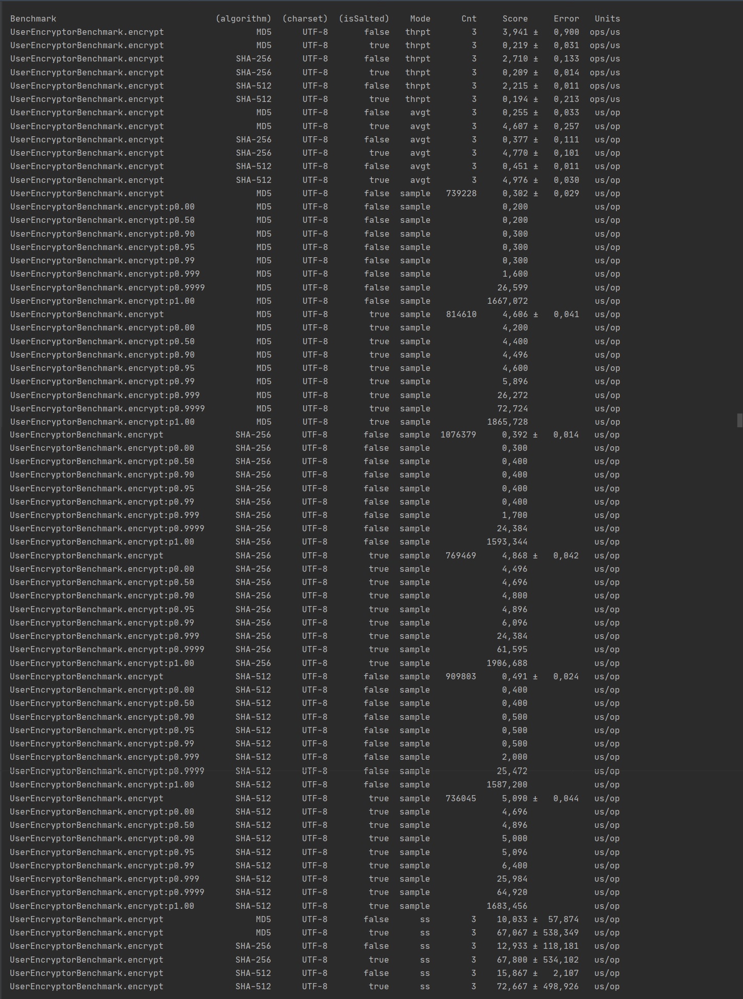
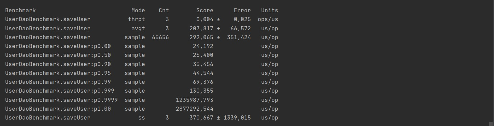
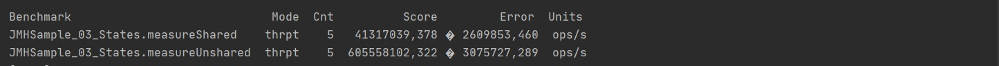
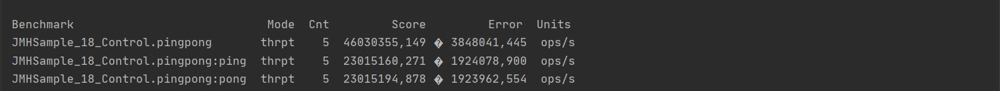
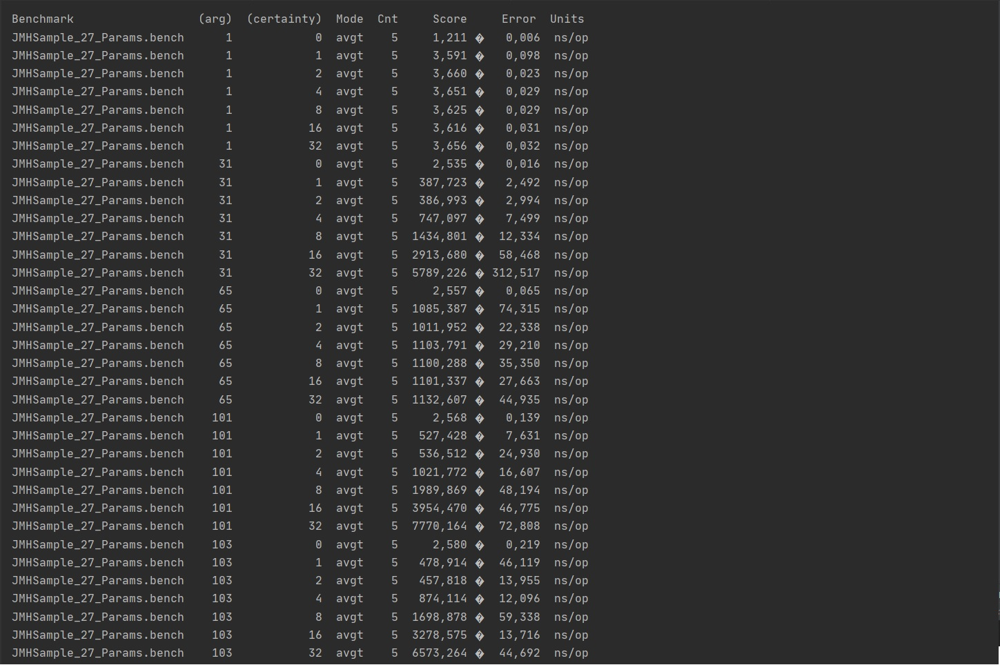

# JMH benchmarking

## Запуск тестов

*mvn clean test* 

## Тесты

### Общие параметры

* fork iterations: 0
* measurement iterations: 3
* warmup iterations: 3
* threads: 1
* output time unit: MICROSECONDS

Показатели производительности:
* AverageTime
* SampleTime
* SingleShotTime
* Throughput

### UserEncryptorBenchmark 

Проверяется производительность шифрования паролей пользователей по алгоритмам:
* MD5
* SHA-256
* SHA-512

Каждый алгоритм проверяется как с применением "соления", так и без.

##### Результат

### UserDaoBenchmark

Проверяется производительность процесса регистрации пользователя с сохранением в БД.
Инициализация spring и транспорт http rest не учитвыаются.

##### Результат

### Отчет по результатам
[Сгенерированный отчет по проведенным тестам](jmh-result.json)

## Примеры тестов OpenJDK

#### JMHSample_03_States

#### JMHSample_18_Control

#### JMHSample_27_Params

