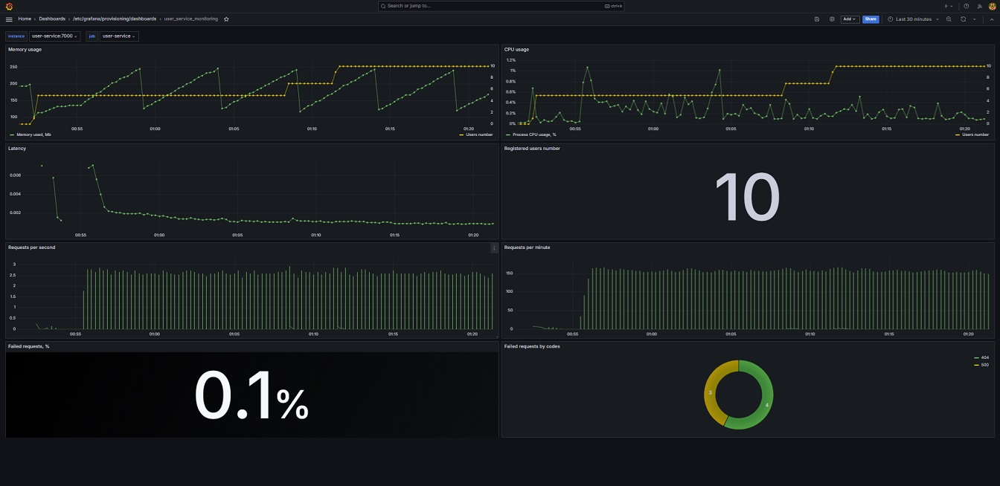
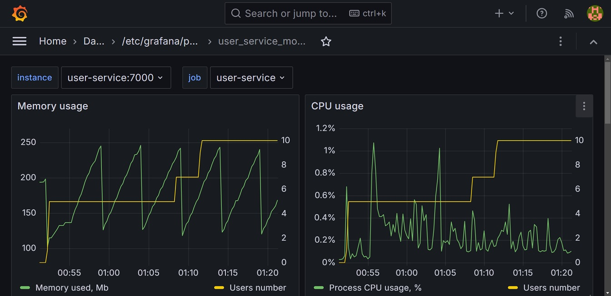
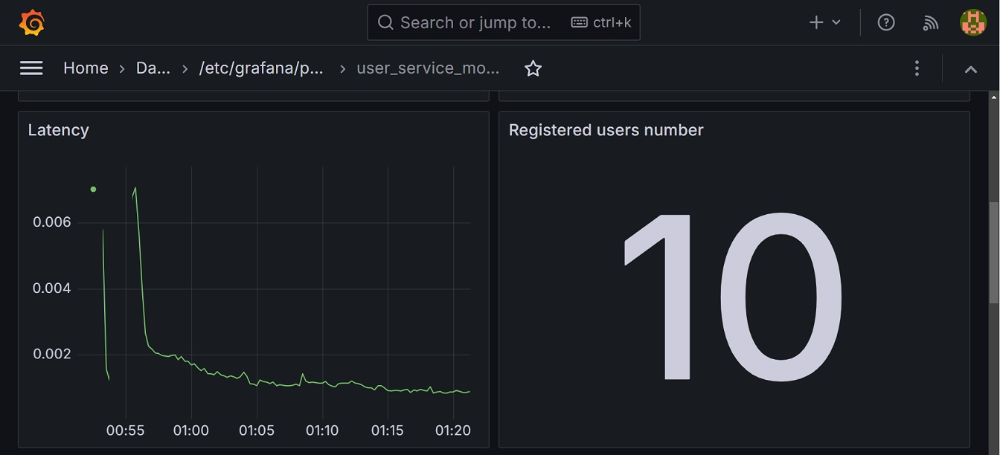
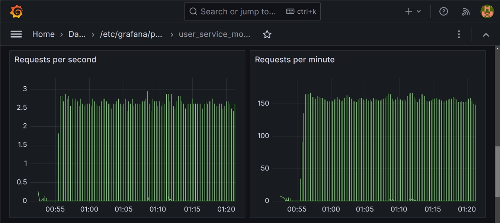
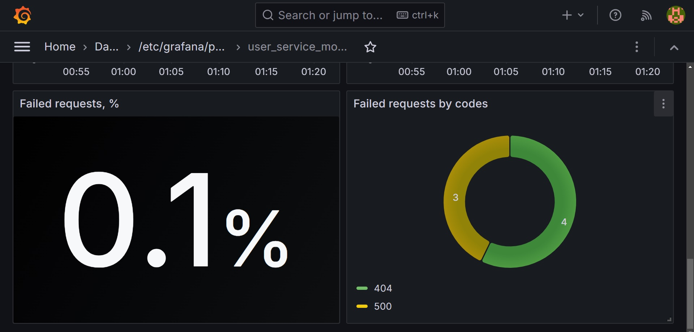

# Реалицация мониторинга сервиса регистрации пользователей

Реализован мониторинг сервиса регистрации пользователей с использованием Prometheus и Grafana.
В сервис регистрации пользователей был внедрен Spring Boot Actuator для обеспечения сбора и передачи метрик.
В дополнение к встроенным добавлена метрика users.number - количество зарегстрированных пользователей.
Для каждого зарегистрированного пользователя сервис запускает процесс мониторинга, постоянно потребляющий ресурсы.
Следовательно, важно отслеживать показатели потребления ресурсов в связке с показателем количества зарегстрированных пользователей.

## Развертывание

*docker build -t user-service .*
 
*docker-compose -f ./monitoring/docker-compose.yml up -d*

UI Grafana доступен по url *localhost:3000*, login: *admin*, password: *12345*

## Нагрузка

Сервис обработал следующие запросы в течение 30 минут: 
* успешная регистрация новых пользователей - 10 раз
* успешное получение данных пользователей - 10 раз в секунду
* ошибочные запросы - 7 раз

## Мониторинг

Создан дашборд с использованием подхода Four golden signals, [json прилагается](./grafana/dashboards/user_service_monitoring.json).

Показатели потребления ресурсов - память и CPU в связке с количеством зарегистрированных пользователей.

Показатель latency - вычисляется как отношение времени запросов к их количеству. Также добавлено количество зарегистрированных пользователей.

Показатели traffic - количество запросов в секунду, количество запросов в минуту

Показатели error по ошибочным http запросам - доля в общем количестве запросов и детализация по кодам состояния.

