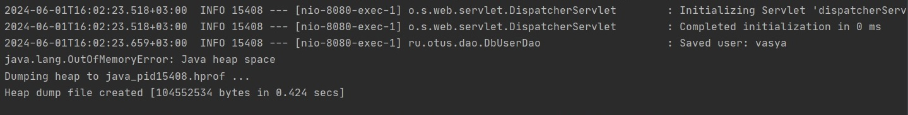
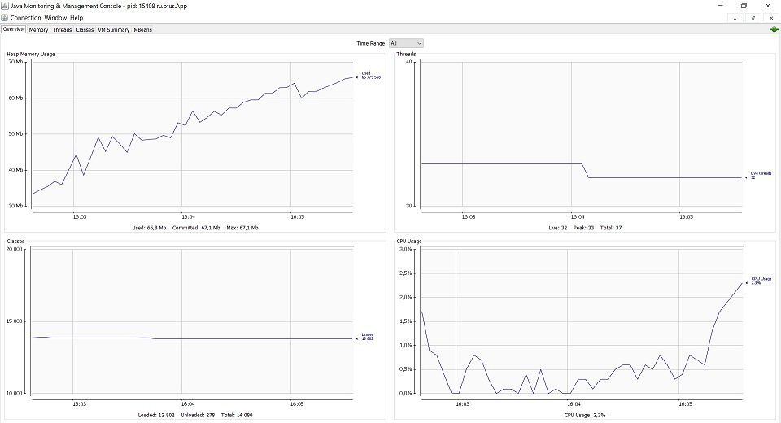
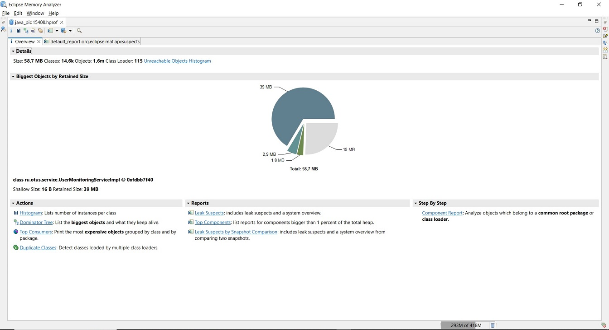
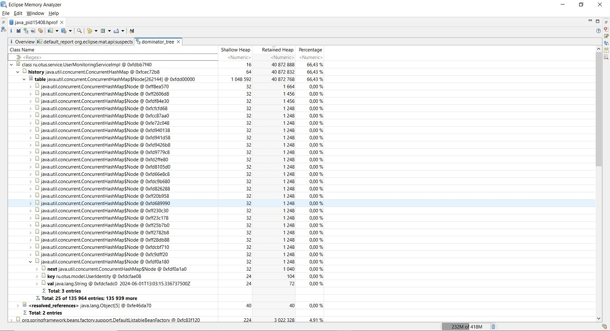
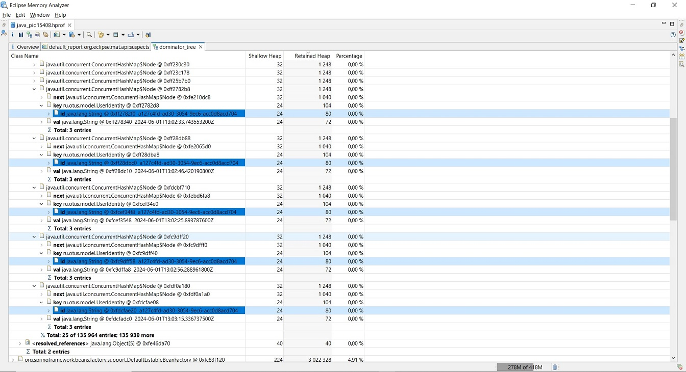
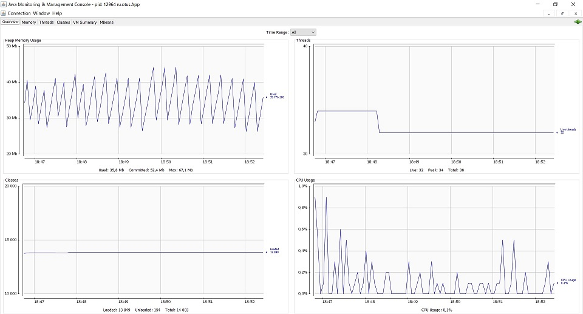
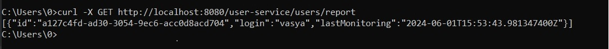

# Out of memory troubleshooting

## Запуск и работа сервиса

Сервис для работы с данными пользователей запускается следующим образом

*java -jar users-service-0.1.jar -Xms16m -Xmx64m -XX:+HeapDumpOnOutOfMemoryError* 

Далее производится добавление нового пользователя

*curl -H "Content-Type: application/json" -d "{\"login\":\"vasya\", \"password\":\"12345\"}" -X POST http://localhost:8080/user-service/users*

В момент добавления пользователя запускается процесс мониторинга пользователя в UserMonitoringServiceImpl:
1. на основании экземпляра User инициализируется UserIdentity
2. в ConcurrentHashMap history по расписанию записываются данные пользователя с UserIdentity в качестве ключа и датой и временем мониторинга в качестве значения.

REST запрос позволяет получить отчет сервиса мониторинга

*curl -X GET http://localhost:8080/user-service/users/report*

Отчет представляет собой список пользователей с указанием даты и времени последнего мониторинга - класс UserData.
На одного пользователя должна приходиться одна запись в history, и, соответственно, одна строка в отчете о мониторинге. 

## Проблема

Приблизительно через три минуты сервис прекращает работу с ошибкой OutOfMemory: Java heap space.

Это говорит об исчерпании сервисом памяти, выделенной для heap, хотя были сохранены данные только одного пользователя.
Утилита jconsole в этот момент показывает следующие JVM метрики сервиса

На диаграмме виден постоянный прирост использования памяти heap без существенного освобождения ресурсов garbage collector.

## Анализ

В момент ошибки был выгружен heap dump, для его анализа использовалась утилита Eclipse Memory Analyzer Tool.

Отчет показал, что основное пространство heap занимает UserMonitoringServiceImpl, осуществляющий мониторинг пользователей.

В dominator tree видно, что самый массивный объект UserMonitoringServiceImpl - ConcurrentHashMap history.
Эта hash map содержит в себе 135 964 записи, хотя был сохранен всего один пользователь, запись должна быть всего одна, 
а значение по ключу UserIdentity перезаписываться по расписанию.

## Вывод

Новый экземпляр UserIdentity инициализировался непосредственно перед записью в history и каждый экземпляр являлся уникальным,
несмотря на то, что логически идентифицировал одного и того же пользователя.

Это подтверждает dominator tree - если развернуть данные о нескольких записях history, 
то в каждом ключе можно наблюдать разные экземпляры UserIdentity с одинаковым значением поля id.
Поле id класса UserIdentity является внутренним идентификатором пользователя для сервиса мониторинга.

## Решение

В UserIdentity методы equals и hashCode были переопределены таким образом, чтобы обеспечить равенство экземпляров класса, идетифицирующих одного и того же пользователя.
Изменения внесены commit https://github.com/OtusTeam/Java-Advanced-homework/commit/94c8632ada950e4f4bd6187dc5a8dfbfa890fb60

## Результат

После внесения соответствующих изменений, перезапуска и добавления нового пользователя сервис работает стабильно.

Утилита jconsole показывает использование памяти heap без постоянного роста и с периодическим освобождением ресурсов garbage collector.

Отчет сервиса мониторинга по REST запросу содержит только одну запись, что соответствует количеству зарегистрированных пользователей.

